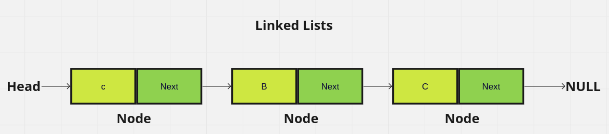
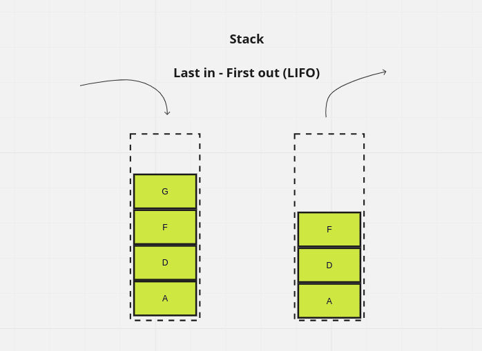
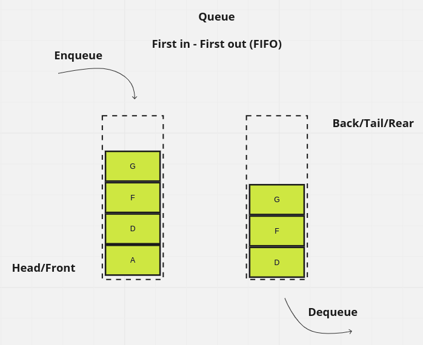
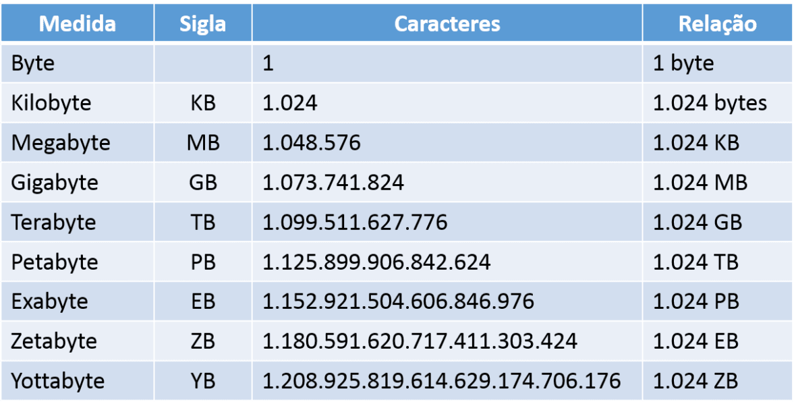

## System Design

### Summary of System Design

  - How do define system requirements? 
  
    

      
System Requirements

      
      1. Requisitos de desempenho: Determine as metas de desempenho do sistema, como tempo de resposta, throughput, capacidade de processamento e escalabilidade. Isso ajudará a dimensionar adequadamente a infraestrutura e os recursos necessários.

      2. Requisitos de disponibilidade: Estabeleça os requisitos de tempo de atividade e disponibilidade do sistema. Isso pode incluir a necessidade de alta disponibilidade, recuperação de falhas e tolerância a falhas para garantir a continuidade dos serviços.

      3. Requisitos de segurança: Identifique os requisitos de segurança do sistema, como autenticação, autorização, criptografia, controle de acesso e proteção contra ameaças, a fim de garantir a integridade e confidencialidade dos dados.

      4. Requisitos de escalabilidade: Considere a capacidade de dimensionamento do sistema para lidar com aumento de carga, tráfego e usuários. Isso pode envolver a capacidade de adicionar ou remover recursos de forma dinâmica, como servidores, nós de processamento ou bancos de dados.

      5. Requisitos de integração: Determine os requisitos de integração do sistema com outros sistemas, serviços externos ou APIs. Isso inclui a definição de protocolos de comunicação, formatos de dados, métodos de autenticação e autorização, e requisitos de troca de informações.

      6. Requisitos de manutenção: Considere os requisitos de manutenção do sistema, como facilidade de atualização, monitoramento, registros e gerenciamento de erros. Isso ajudará a garantir a operação eficiente e a resolução rápida de problemas.

      7. Requisitos de usabilidade: Avalie os requisitos de usabilidade e experiência do usuário, considerando a interface do usuário, a facilidade de navegação, a capacidade de resposta e a acessibilidade.

      8. Requisitos legais e regulatórios: Verifique se o sistema precisa cumprir requisitos legais, regulatórios ou de conformidade específicos, como privacidade de dados, proteção de informações pessoais ou conformidade com padrões de segurança.

      - Esses são apenas alguns exemplos de requisitos de sistema comuns. É importante adaptar esses requisitos às necessidades específicas do projeto e do domínio de aplicação em questão.
    

    

      
Functional Requirements

      1. Autenticação e autorização: O sistema deve fornecer recursos de autenticação para verificar a identidade dos usuários e autorização para controlar o acesso aos recursos com base em papéis ou permissões específicas.

      2. Gerenciamento de usuários: O sistema deve permitir o cadastro, gerenciamento e manutenção de informações de usuários, incluindo perfis, credenciais de login e dados pessoais.

      3. Fluxo de trabalho e processos: O sistema deve suportar fluxos de trabalho específicos ou processos de negócios, fornecendo recursos para rastrear, gerenciar e automatizar as etapas e a colaboração envolvida.

      4. Gerenciamento de conteúdo: O sistema deve permitir a criação, edição, exclusão e publicação de conteúdo, como artigos, documentos, imagens ou vídeos.

      5. Comunicação e colaboração: O sistema deve oferecer recursos de comunicação e colaboração entre os usuários, como mensagens instantâneas, compartilhamento de arquivos, fóruns ou espaços de trabalho compartilhados.

      6. Processamento de transações: Se o sistema estiver envolvido em transações financeiras ou comerciais, ele deve ser capaz de processar transações de forma segura e confiável, incluindo verificação, autorização e registro de transações.

      7. Relatórios e análises: O sistema deve fornecer recursos para gerar relatórios e análises com base em dados coletados ou gerados pelo sistema, permitindo insights e tomada de decisões informadas.

      8. Integração de sistemas: O sistema pode precisar integrar-se a outros sistemas, como serviços externos, bancos de dados ou APIs, para troca de informações ou interoperabilidade.

      Lembre-se de que esses requisitos funcionais devem ser adaptados às necessidades específicas do projeto e do domínio de aplicação em questão. É importante entender bem os requisitos do sistema e envolver as partes interessadas relevantes para garantir que os requisitos funcionais sejam abordados adequadamente no design do sistema.
    

    - High Availability
    - Fault Tolerance, resilience, reliability
    - Scalability
    - Performance
    - Durability
    - Consistency
    - Mentability, security, cost
  - How to achieve certain system qualities with the help of hardware?
    - Regions, availability zones, data centers, racks, servers
    - Physical servers, virtual machines, containers, serverless
  - Fundamentals of reliable, scalable, and fast communication
    - Syncronous vs Asyncronous communication
    - Asynchronous messaging patterns
    - Network protocols
    - Blocking vs non-blocking I/O
    - Data encoding formats
    - Message acknowledgement
  - How to improve system performance with caching?
    - Caching 
    - Caching strategies
    - Cache invalidation
    - Cache eviction policies
    - Cache consistency
    - Cache coherency
    - Cache partitioning
    - Cache aside vs read through vs write through
    - Deduplication cache
    - Metadata cache
  - The importance of queues in distributed systems
    - Message queues
    - Task queues
    - Priority queues
    - Delay queues
    - Bounded queues
    - Unbounded queues
    - Blocking queues
    - Producer-consumer pattern
    - Thread pools
  - Data store internals
    - Log
    - Index
    - Time series data
    - Simple key-value database
    - B-tree index
    - Embedded database
    - RocksDB
    - LSM-tree vs B-tree
    - Page cache
  - How to build efficient communication in distributed systems?
    - Push vs pull
    - Host discovery
    - Service discovery
    - Peer discovery
    - How to choose a network protocol?
    - Network protocols in real-life systems
    - Video over HTTP
    - CDN
    - Push and pull technologies
    - Large scale push architectures
  - How to deliver data reliably?
    - What else to know to build reliable, scalable, and fast systems?
    - What to do with failed requests?
    - When to retry?
    - How to retry?
    - Message delivery garanties
    - Consummer offsets
  - How to delivery data quickly?
    - Batching
    - Compression
  - How to deliver data at large scale?
    - How to scale message consumption?
    - Partitioning in real-life systems
    - Partioning strategies
    - Request routing
    - Rebalancing partitions
    - Consistent hashing
  - How to protect servers from clients?
    - System overload
    - Autoscaling
    - Autoscaling system design
    - Load shedding
    - Rate Limiting
  - How to protect clients from servers?
    - Syncronous vs Asyncronous clients
    - Circuit breaker
    - Fail-fast design principle
    - Bulkhead
    - Shuffle sharding

### System Design Basics

  
client-server model

  
  O modelo cliente-servidor é uma abordagem arquitetônica utilizada em sistemas de rede e aplicativos de computador, onde há uma divisão clara de papéis e responsabilidades entre os componentes chamados "cliente" e "servidor". Esse modelo permite que dispositivos ou programas se comuniquem e trabalhem juntos de maneira eficiente.

  Nesse modelo, o cliente é um dispositivo ou programa que solicita e utiliza os serviços fornecidos por outro dispositivo ou programa chamado servidor. O cliente inicia a comunicação enviando uma solicitação ao servidor, e o servidor responde a essa solicitação fornecendo os serviços ou recursos solicitados. Essa interação é baseada em um protocolo de comunicação, como HTTP (Hypertext Transfer Protocol) para aplicativos da web ou SMTP (Simple Mail Transfer Protocol) para envio de e-mails.

  
networks protocols

  Os protocolos de rede são conjuntos de regras e procedimentos que governam a comunicação entre dispositivos em uma rede. Eles definem como os dispositivos trocam dados, estabelecem conexões, detectam erros, gerenciam endereçamento e realizam outras funções essenciais para a comunicação eficiente na rede. Aqui estão alguns dos protocolos de rede mais comuns:

  1. TCP/IP (Transmission Control Protocol/Internet Protocol): É o conjunto de protocolos mais amplamente utilizado na Internet. O TCP é responsável pelo controle de transmissão confiável dos dados, enquanto o IP é responsável pelo endereçamento e roteamento dos pacotes na rede.

  2. HTTP (Hypertext Transfer Protocol): É um protocolo usado para transferir recursos, como páginas da web, na World Wide Web. Ele permite a comunicação entre clientes e servidores web.

  3. HTTPS (Hypertext Transfer Protocol Secure): É uma extensão do HTTP que adiciona uma camada de segurança usando criptografia. É amplamente usado para acessar sites seguros, como serviços bancários online e compras.

  4. FTP (File Transfer Protocol): É um protocolo usado para transferir arquivos entre um cliente e um servidor em uma rede. Ele permite fazer upload, download e gerenciar arquivos em servidores remotos.

  5. SMTP (Simple Mail Transfer Protocol): É usado para enviar e-mails entre servidores de e-mail. É responsável pela transferência confiável de mensagens de e-mail pela Internet.

  6. POP3 (Post Office Protocol version 3): É um protocolo usado pelos clientes de e-mail para recuperar mensagens de um servidor de e-mail remoto. Ele permite que os usuários façam o download de e-mails para seus dispositivos.

  7. IMAP (Internet Message Access Protocol): É outro protocolo de e-mail que permite que os clientes acessem e gerenciem mensagens de e-mail armazenadas em um servidor remoto. Ao contrário do POP3, o IMAP permite que os usuários visualizem e organizem as mensagens no servidor sem precisar fazer o download delas.

  Esses são apenas alguns exemplos de protocolos de rede. Existem muitos outros protocolos que desempenham funções específicas em diferentes camadas do modelo OSI (Open Systems Interconnection) ou do modelo TCP/IP. Cada protocolo tem seu propósito e características específicas, e sua seleção depende das necessidades e requisitos da rede ou aplicativo em questão.

  
storage

  O armazenamento refere-se ao processo de retenção e organização de dados, informações e arquivos em dispositivos físicos ou sistemas de armazenamento digital. É essencial para preservar e acessar dados de maneira confiável e eficiente. Existem várias formas de armazenamento, incluindo:

  1. Armazenamento local: Envolve o uso de dispositivos de armazenamento físico conectados diretamente a um computador ou servidor. Exemplos comuns incluem discos rígidos (HDDs), unidades de estado sólido (SSDs), unidades de fita e unidades ópticas (como CDs e DVDs). O armazenamento local é rápido e oferece acesso direto aos dados, mas está limitado pela capacidade física do dispositivo.

  2. Armazenamento em rede: Refere-se ao uso de dispositivos de armazenamento conectados a uma rede, como servidores de arquivos ou sistemas de armazenamento em rede (NAS - Network Attached Storage). Isso permite que vários dispositivos acessem e compartilhem os dados armazenados centralmente. É útil para compartilhar arquivos e recursos em ambientes de rede, mas também pode exigir configuração e gerenciamento adicionais.

  3. Armazenamento em nuvem: É um modelo de armazenamento baseado na Internet, onde os dados são armazenados em servidores remotos e acessados por meio da Internet. Provedores de serviços em nuvem, como Amazon Web Services (AWS), Google Cloud Platform (GCP) e Microsoft Azure, oferecem espaço de armazenamento virtualmente ilimitado, permitindo armazenar e acessar dados de qualquer lugar com conexão à Internet. O armazenamento em nuvem é escalável, flexível e geralmente oferece recursos adicionais, como backup automático e compartilhamento de arquivos.

  5. Armazenamento em memória flash: É uma tecnologia de armazenamento digital não volátil que usa chips de memória flash para armazenar dados. É amplamente usado em dispositivos como unidades USB, cartões de memória, SSDs e dispositivos móveis. A memória flash é rápida, resistente a choques e consome menos energia em comparação com as unidades de disco rígido tradicionais.

  Além disso, existem outras formas de armazenamento, como armazenamento em banco de dados, armazenamento em cache e armazenamento em memória RAM, que são otimizados para diferentes tipos de dados e aplicações específicas.

  A escolha do tipo de armazenamento depende dos requisitos individuais, como capacidade, velocidade, confiabilidade, segurança e custo. Frequentemente, uma combinação de diferentes tecnologias de armazenamento é usada para atender às necessidades específicas de um sistema ou organização.

  
latency and throughput

  Latência e taxa de transferência (throughput) são dois conceitos importantes relacionados ao desempenho e eficiência de sistemas de comunicação e armazenamento de dados. Ambos têm um impacto significativo na experiência do usuário e na capacidade de processamento dos sistemas. Vamos entender melhor cada um deles:

  1. Latência: A latência é o tempo decorrido entre o envio de uma solicitação de dados e o recebimento da resposta. É uma medida do atraso que ocorre durante a transmissão ou processamento de informações. A latência é influenciada por vários fatores, como a distância física entre os dispositivos, a velocidade do meio de comunicação utilizado (por exemplo, cabos de fibra ótica ou conexões sem fio), o tempo de processamento necessário nos dispositivos envolvidos e a eficiência dos protocolos de comunicação utilizados. Uma latência menor é desejável, pois implica em tempos de resposta mais rápidos e maior agilidade nos sistemas.

  2. Taxa de transferência (Throughput): A taxa de transferência é a quantidade de dados que pode ser transmitida em um determinado período de tempo. É uma medida da capacidade de processamento ou da largura de banda de um sistema. A taxa de transferência é influenciada por vários fatores, como a largura de banda da rede, a capacidade de processamento dos dispositivos envolvidos, o tipo de meio de comunicação utilizado e a eficiência dos protocolos de comunicação. Uma taxa de transferência mais alta é desejável, pois indica uma maior capacidade de processamento e transmissão de dados.

  É importante observar que a latência e a taxa de transferência são conceitos distintos, embora estejam relacionados. Uma alta taxa de transferência pode ajudar a reduzir o tempo total necessário para transmitir uma grande quantidade de dados, enquanto uma baixa latência pode melhorar a responsividade de uma aplicação ou sistema em tempo real. Ambos os aspectos são relevantes em diferentes contextos e precisam ser considerados ao projetar e avaliar sistemas de comunicação e armazenamento de dados, dependendo dos requisitos específicos e das necessidades do uso pretendido.

  
higher availability and consistency

  Alta disponibilidade e consistência são dois conceitos fundamentais em sistemas distribuídos e serviços online. Ambos visam garantir a confiabilidade e a qualidade dos sistemas em diferentes aspectos. Vamos entender melhor cada um deles:

  1. Alta disponibilidade: A alta disponibilidade refere-se à capacidade de um sistema ou serviço estar continuamente disponível e acessível aos usuários, com um tempo de inatividade mínimo. Isso implica que o sistema esteja funcionando corretamente e que os usuários possam acessá-lo sempre que precisarem. Para alcançar alta disponibilidade, são implementadas medidas como redundância de hardware e software, replicação de dados, balanceamento de carga, sistemas de recuperação de falhas e tolerância a falhas. Essas estratégias garantem que, mesmo se ocorrerem falhas em componentes individuais, o sistema continue operacional e os serviços permaneçam disponíveis para os usuários.

  2. Consistência: A consistência refere-se à propriedade de um sistema de garantir que todos os seus nós ou componentes tenham uma visão coerente e atualizada dos dados. Em sistemas distribuídos, onde várias cópias dos dados são mantidas em diferentes nós, garantir a consistência dos dados é um desafio. A consistência pode ser alcançada através de técnicas de sincronização e controle de concorrência, onde as operações de escrita e leitura são coordenadas para evitar leituras desatualizadas ou inconsistências nos dados. Diferentes modelos de consistência, como consistência forte ou consistência eventual, são adotados com base nos requisitos específicos do sistema e das aplicações.

  É importante destacar que há um trade-off entre alta disponibilidade e consistência. Em muitos casos, manter alta disponibilidade pode resultar em algum grau de inconsistência temporária nos dados, enquanto garantir uma consistência estrita pode levar a períodos de inatividade para sincronização e atualização dos dados. A escolha entre alta disponibilidade e consistência depende dos requisitos e das necessidades do sistema ou serviço em questão. Alguns sistemas podem priorizar a alta disponibilidade em cenários onde a disponibilidade contínua é crítica, enquanto outros podem priorizar a consistência em cenários onde a precisão dos dados é fundamental.

  
caching

  Caching (ou cache) é uma técnica amplamente utilizada em sistemas de computação para melhorar o desempenho e a eficiência ao armazenar dados temporariamente em um local mais rápido e de acesso mais rápido do que a fonte original. O cache é uma memória auxiliar que armazena cópias de dados frequentemente acessados para fornecer acesso rápido a esses dados, reduzindo a necessidade de acessar a fonte original, que pode ser mais lenta.

  Quando um sistema faz uma solicitação por determinados dados, a primeira instância é verificar se esses dados estão disponíveis no cache. Se os dados estiverem no cache, eles são acessados diretamente, evitando a necessidade de recuperá-los da fonte original. Isso resulta em tempos de acesso mais rápidos e uma melhoria geral no desempenho.

  O cache é usado em vários níveis e em diferentes componentes de sistemas de computação. Alguns exemplos comuns incluem:

  1. Cache de hardware: Processadores modernos possuem caches embutidos em diferentes níveis (L1, L2, L3) para armazenar cópias de dados e instruções frequentemente utilizados. Esses caches são projetados para minimizar a latência de acesso à memória principal e acelerar a execução de instruções.

  2. Cache de software: Aplicativos e sistemas operacionais também podem utilizar caches em nível de software para armazenar dados frequentemente acessados. Isso pode incluir o cache de páginas da web em navegadores, cache de banco de dados, cache de arquivos em sistemas de arquivos, entre outros.

  3. Cache de rede: Em redes de computadores, os caches são usados para armazenar cópias de páginas da web, objetos de mídia, arquivos e outros dados frequentemente acessados. Isso é especialmente útil em servidores proxy, servidores de conteúdo em CDN (Content Delivery Network) e outros dispositivos de rede, que podem fornecer respostas mais rápidas aos clientes ao acessar dados armazenados em cache localmente.

  4. Cache de aplicativo: Aplicativos podem implementar caches para armazenar resultados de cálculos computacionalmente intensivos, resultados de consultas de banco de dados ou qualquer dado que possa ser reutilizado posteriormente. Esses caches ajudam a evitar o processamento repetido e a acelerar a resposta do aplicativo.

  Ao implementar caches, é necessário considerar estratégias de gerenciamento, como a substituição de dados no cache (políticas de substituição) e a atualização dos dados em cache para refletir mudanças na fonte original (invalidação ou expiração). O tamanho do cache também precisa ser considerado para equilibrar o espaço de armazenamento disponível e o benefício do cache.

  O caching é uma técnica poderosa para melhorar o desempenho, reduzir a carga em sistemas e otimizar a experiência do usuário, tornando o acesso a dados frequentes mais rápido e eficiente.

  
proxies

  Proxies (ou servidores proxy) são intermediários entre os clientes e os servidores de destino em uma rede. Eles atuam como uma camada intermediária que recebe as solicitações dos clientes e encaminha essas solicitações aos servidores de destino, agindo em nome dos clientes. Os proxies podem desempenhar várias funções e oferecer diferentes benefícios. Vamos explorar algumas delas:

  1. Anonimato e privacidade: Um proxy pode ocultar o endereço IP do cliente, substituindo-o pelo seu próprio endereço IP. Isso proporciona anonimato e privacidade ao navegar na Internet, pois os servidores de destino não têm conhecimento direto do endereço IP do cliente original.

  2. Cache e aceleração de conteúdo: Os proxies podem armazenar em cache as respostas de servidores de destino para solicitações comuns. Quando um cliente faz uma solicitação semelhante, o proxy pode fornecer a resposta armazenada em cache em vez de encaminhar a solicitação ao servidor de destino novamente. Isso reduz o tempo de resposta e economiza largura de banda.

  3. Filtragem de conteúdo: Proxies podem ser usados para filtrar e bloquear certos tipos de conteúdo indesejado, como sites maliciosos, spam, anúncios ou conteúdo inapropriado. Isso é útil em ambientes corporativos ou em redes públicas para proteger os usuários contra ameaças e garantir o cumprimento de políticas de uso aceitável.

  4. Balanceamento de carga: Proxies também podem ser usados para distribuir o tráfego de entrada entre vários servidores de destino, distribuindo a carga de trabalho de forma mais equilibrada. Isso melhora o desempenho e a disponibilidade, evitando sobrecarga de servidores individuais.

  5. Controle de acesso: Os proxies podem ser configurados para controlar o acesso a recursos específicos, permitindo ou negando solicitações com base em regras de segurança ou políticas de acesso. Isso ajuda a reforçar a segurança da rede e proteger os recursos contra acessos não autorizados.

  Existem diferentes tipos de proxies, como proxies HTTP, proxies SOCKS, proxies reversos e proxies transparentes, cada um com suas características específicas e casos de uso. Os proxies podem ser implementados em hardware dedicado ou como software em sistemas ou dispositivos específicos.

  É importante mencionar que o uso de proxies também pode apresentar desvantagens, como a possível introdução de um ponto único de falha, impacto na latência das comunicações devido à introdução de um nó intermediário e a necessidade de configurar corretamente as políticas e regras de proxy para evitar problemas de acesso ou desempenho.

  Em resumo, os proxies desempenham um papel importante na rede, fornecendo funcionalidades adicionais, como anonimato, cache, filtragem, balanceamento de carga e controle de acesso. Eles são ferramentas versáteis que podem melhorar a segurança, desempenho e eficiência da comunicação entre clientes e servidores em uma rede.

  
load balancing

  Load balancing é o processo de distribuir eficientemente o tráfego de rede de entrada em um grupo de servidores de back-end, também conhecido como um pool ou farm de servidores¹. Isso é feito para garantir que nenhum servidor fique sobrecarregado, o que poderia prejudicar o desempenho. Se um único servidor falhar, o balanceador de carga redireciona o tráfego para os servidores restantes que estão online. Quando um novo servidor é adicionado ao grupo de servidores, o balanceador de carga automaticamente começa a enviar solicitações para ele.

  Existem diferentes algoritmos de balanceamento de carga que fornecem diferentes benefícios; a escolha do método de balanceamento de carga depende das suas necessidades. Alguns exemplos incluem Round Robin, Least Connections, Least Time, Hash e IP Hash.

  O balanceamento de carga é importante porque ajuda a reduzir o tempo de inatividade, aumentar a escalabilidade e a redundância, fornecer flexibilidade e melhorar a eficiência. É comumente usado em sites com alto tráfego, servidores DNS, bancos de dados e sites FTP. Isso garante que as solicitações do usuário sejam processadas rapidamente e com precisão².

  
hashing

  - Hashing é um processo utilizado para mapear dados de tamanho variável para um valor fixo, geralmente uma sequência de caracteres de tamanho fixo. O resultado desse processo é chamado de "hash" ou "valor de hash". O objetivo do hashing é gerar um resumo único e representativo dos dados de entrada, de forma eficiente e determinística.

  - Principais características e usos do hashing:

  1. Unicidade: Um bom algoritmo de hash deve minimizar a probabilidade de colisões, ou seja, de gerar o mesmo valor de hash para diferentes conjuntos de dados. Embora seja possível que dois conjuntos de dados diferentes gerem o mesmo valor de hash (colisão), algoritmos de hash comumente utilizados possuem uma baixa taxa de colisões.

  2. Integridade: O valor de hash é usado para verificar se os dados foram alterados ou corrompidos. Qualquer modificação nos dados de entrada resultará em um valor de hash completamente diferente. Isso torna o hashing útil para detectar alterações acidentais ou maliciosas nos dados.

  3. Eficiência: Algoritmos de hash são projetados para serem rápidos e eficientes, permitindo o processamento rápido dos dados e o cálculo do valor de hash. Mesmo para grandes volumes de dados, o tempo necessário para calcular o valor de hash é geralmente muito pequeno.

  4. Criptografia: Algoritmos de hash criptográficos, como SHA-256 (Secure Hash Algorithm 256 bits), são usados para garantir a segurança e a confidencialidade dos dados. Esses algoritmos são amplamente utilizados em aplicações como autenticação de senhas, assinatura digital e verificação de integridade de arquivos.

  5. Indexação e pesquisa: O hashing também é usado em estruturas de dados como tabelas de dispersão (hash tables), que permitem uma pesquisa eficiente de elementos com base em suas chaves. Os valores de hash são usados para mapear as chaves para posições de armazenamento, acelerando o processo de busca.

  - Alguns exemplos de algoritmos de hashing amplamente utilizados são MD5 (Message Digest Algorithm 5), SHA-1 (Secure Hash Algorithm 1), SHA-256, SHA-3 e HMAC (Hash-based Message Authentication Code). Cada um desses algoritmos tem suas próprias características e níveis de segurança, sendo selecionados de acordo com as necessidades específicas de cada aplicação.

  - É importante notar que, embora os algoritmos de hash sejam úteis em várias aplicações, eles não são reversíveis. Isso significa que, uma vez que os dados são convertidos em um valor de hash, não é possível recuperar os dados originais a partir do valor de hash. Portanto, os algoritmos de hash são usados principalmente para verificação, resumo e pesquisa eficiente, mas não para fins de criptografia ou armazenamento seguro de dados.

  
Data Structures

  - Estruturas de dados se referem à forma como os dados são organizados, armazenados e manipulados em programas de computador. Elas fornecem uma maneira eficiente de armazenar e recuperar dados, realizar operações sobre eles e representar relacionamentos entre diferentes partes de dados. Aqui estão algumas estruturas de dados comuns:

    1. Array: Um array é uma coleção de elementos do mesmo tipo, armazenados em locais de memória contíguos. Os elementos em um array podem ser acessados usando seu índice. Os arrays têm um tamanho fixo e são eficientes para acesso aleatório, mas podem ser custosos para inserções ou remoções.
    
    2. Linked List: Uma lista encadeada é uma coleção de nós, onde cada nó contém dados e uma referência (link) para o próximo nó. Ao contrário dos arrays, as listas encadeadas podem crescer e diminuir dinamicamente. As listas encadeadas são eficientes para inserções e remoções, mas o acesso aos elementos por índice requer percorrer a lista a partir do início.
    
    3. Stack: Uma pilha é uma estrutura de dados Last-In-First-Out (LIFO), onde os elementos são adicionados e removidos do mesmo extremo chamado topo. Ela segue as operações "push" (adição) e "pop" (remoção).
    
    4. Queue: Uma fila é uma estrutura de dados First-In-First-Out (FIFO), onde os elementos são adicionados no final e removidos no início. Ela segue as operações "enqueue" (adição) e "dequeue" (remoção).
    
    5. Tree: Uma fila é uma estrutura de dados First-In-First-Out (FIFO), onde os elementos são adicionados no final e removidos no início. Ela segue as operações "enqueue" (adição) e "dequeue" (remoção).
    
    6. Graph: Um grafo é uma coleção de nós (vértices) conectados por arestas. Ele representa relacionamentos entre diferentes entidades. Os grafos podem ser direcionados (as arestas têm uma direção específica) ou não direcionados (as arestas não têm direção).
    
    7. Hash Table: Uma tabela de hash (ou mapa de hash) é uma estrutura de dados que usa uma função de hash para mapear chaves aos valores. Ela fornece operações eficientes de inserção, remoção e recuperação. As tabelas de hash são comumente usadas para implementar dicionários e bancos de dados.
    
    8. Heap: Um heap é uma estrutura de dados baseada em árvore binária que satisfaz a propriedade de heap. Ele permite a recuperação eficiente do elemento máximo (ou mínimo). Heaps são frequentemente usados em filas de prioridade e algoritmos de classificação.
    
    9. Graphical Structures: Isso inclui várias estruturas de dados usadas para representar objetos gráficos, como linhas, formas, imagens e polígonos. Exemplos incluem vetores, matrizes e árvores quádruplas.

  - A escolha da estrutura de dados apropriada depende dos requisitos específicos do problema em questão, considerando fatores como eficiência, uso de memória e o tipo de operações necessárias. Compreender e utilizar efetivamente as estruturas de dados é essencial para o design eficiente de algoritmos e otimização na programação de computadores.

  
  
  
  

  
SQL and NoSQL

  - SQL (Structured Query Language) e NoSQL (Not Only SQL) são dois tipos diferentes de bancos de dados, cada um com suas características, modelos de armazenamento e casos de uso distintos. Vamos entender melhor cada um deles:

  - SQL:
    - SQL é uma linguagem de consulta estruturada amplamente utilizada para gerenciar bancos de dados relacionais. Os bancos de dados SQL são baseados no modelo relacional, que organiza os dados em tabelas com linhas e colunas. Alguns exemplos de bancos de dados SQL populares são MySQL, PostgreSQL, Oracle, SQL Server e SQLite.

    - Características do SQL:

      - Esquema rígido: Os bancos de dados SQL têm um esquema rígido, o que significa que a estrutura das tabelas, os tipos de dados e as relações entre elas são definidos antecipadamente. Qualquer alteração na estrutura requer modificações no esquema.

      - ACID: Os bancos de dados SQL seguem as propriedades ACID (Atomicidade, Consistência, Isolamento e Durabilidade) para garantir a integridade e a consistência dos dados. Isso significa que as transações são tratadas de forma segura e confiável.

      - Consultas poderosas: Com a linguagem SQL, é possível realizar consultas complexas e avançadas para recuperar, manipular e combinar dados de várias tabelas. As consultas SQL oferecem recursos como junções, agregações, ordenações e filtragens.

      - Escalabilidade vertical: Os bancos de dados SQL tendem a escalar verticalmente, o que significa aumentar a capacidade de hardware de uma única máquina para lidar com mais carga. Isso geralmente envolve o upgrade do hardware existente.

  - NoSQL:
    - NoSQL é uma categoria de bancos de dados que oferece uma alternativa ao modelo relacional tradicional. Ao contrário dos bancos de dados SQL, os bancos de dados NoSQL não seguem um esquema fixo e oferecem modelos de armazenamento flexíveis. Eles são projetados para atender a requisitos específicos de escalabilidade, desempenho e flexibilidade. Alguns exemplos de bancos de dados NoSQL são MongoDB, Cassandra, Redis e Couchbase.

    - Características do NoSQL:

      - Esquema flexível: Os bancos de dados NoSQL permitem a adição de novos campos ou estruturas sem a necessidade de modificar um esquema rígido. Isso oferece flexibilidade para trabalhar com dados não estruturados ou semiestruturados.

      - Escalabilidade horizontal: Os bancos de dados NoSQL são projetados para escalar horizontalmente, adicionando mais nós ou servidores para distribuir a carga de trabalho. Isso permite lidar com grandes volumes de dados e aumentar a capacidade de armazenamento e processamento conforme necessário.

      - Desempenho: Os bancos de dados NoSQL são otimizados para obter alto desempenho em cargas de trabalho específicas, como leitura e gravação intensivas ou processamento em tempo real. Eles geralmente oferecem baixa latência e alta capacidade de resposta.

      - Modelos de dados variados: Os bancos de dados NoSQL oferecem diferentes modelos de armazenamento, como chave-valor, documento, coluna larga (wide column) e grafos. Cada modelo é adequado para diferentes tipos de dados e casos de uso específicos.

  - Os bancos de dados SQL e NoSQL têm seus prós e contras, e a escolha entre eles depende dos requisitos e das características do projeto em questão. Em geral, os bancos de dados SQL são amplamente utilizados em aplicativos que exigem integridade de dados, consultas complexas e transações ACID, enquanto os bancos de dados NoSQL são mais adequados para cenários que requerem escalabilidade, flexibilidade de esquema e desempenho em larga escala.

  

  
replication and sharding

  Replicação e sharding são duas estratégias comumente usadas em sistemas distribuídos para melhorar o desempenho, escalabilidade e disponibilidade.

  - Replicação:

  - A replicação envolve criar e manter cópias idênticas dos dados em vários nós do sistema distribuído. Cada cópia, ou réplica, contém os mesmos dados, permitindo que o sistema atenda a solicitações de leitura de forma mais eficiente e ofereça maior tolerância a falhas. Alguns pontos importantes sobre replicação são:

  1. Redundância e disponibilidade: Com réplicas dos dados distribuídas em diferentes nós, o sistema pode continuar a operar mesmo se um ou mais nós falharem. Se um nó ficar inativo, as solicitações podem ser redirecionadas para uma réplica ativa, mantendo a disponibilidade do sistema.

  2. Melhor desempenho de leitura: Com réplicas distribuídas, as solicitações de leitura podem ser processadas em paralelo por nós diferentes. Isso aumenta a capacidade de resposta do sistema e melhora o desempenho em termos de leitura de dados.

  3. Consistência dos dados: Garantir a consistência dos dados em todas as réplicas é um desafio na replicação. Existem diferentes níveis de consistência, como consistência forte e consistência eventual, que determinam a sincronização e atualização das réplicas.

  - Sharding:

  - O sharding envolve dividir horizontalmente os dados em várias partes, chamadas de shards, e distribuí-las em diferentes nós do sistema distribuído. Cada nó é responsável por um subconjunto dos dados, permitindo uma distribuição de carga equilibrada e melhor desempenho de escrita. Alguns pontos importantes sobre sharding são:

  1. Escalabilidade: O sharding permite que o sistema distribuído lide com grandes volumes de dados e altas taxas de transações. Ao dividir os dados em shards, o sistema pode distribuir a carga entre os nós e evitar gargalos de desempenho.

  2. Distribuição de dados: Cada shard contém um subconjunto dos dados, permitindo que diferentes nós processem solicitações de forma independente. Isso possibilita uma paralelização eficiente das operações e um melhor desempenho em termos de escrita e consulta.

  3. Complexidade do gerenciamento: O sharding aumenta a complexidade do gerenciamento de dados, pois é necessário garantir a consistência e integridade dos dados distribuídos em diferentes shards. O roteamento de solicitações e a coordenação entre os nós também são desafios no sharding.

  4. Rebalanceamento: À medida que o sistema cresce ou a distribuição de dados muda, pode ser necessário reequilibrar os shards, movendo os dados entre os nós. O rebalanceamento é uma tarefa desafiadora, pois requer planejamento e coordenação cuidadosos para garantir que os dados sejam movidos sem afetar a disponibilidade ou a consistência do sistema.

  - Tanto a replicação quanto o sharding são estratégias valiosas em sistemas distribuídos, e muitas vezes são usadas em conjunto para obter os benefícios de alta disponibilidade, escalabilidade e desempenho. A escolha entre replicação, sharding ou uma combinação de ambos depende das características

  
leader election

  - Leader election (eleição de líder) é um processo utilizado em sistemas distribuídos para selecionar um único nó (ou processo) entre vários para atuar como líder ou coordenador. O líder é responsável por tomar decisões e coordenar as atividades dos demais nós no sistema distribuído.

  - A eleição de líder é necessária em sistemas distribuídos para garantir a consistência e a coerência das operações. Quando o líder atual falha ou é desconectado do sistema, um novo líder precisa ser eleito para assumir suas responsabilidades. Esse processo de eleição ocorre de forma automática entre os nós remanescentes e é crucial para manter a continuidade do sistema.

  - Existem várias abordagens e algoritmos para realizar a eleição de líder. Alguns dos algoritmos populares incluem:

  1. Algoritmo do Bully: Neste algoritmo, cada nó tem um identificador único e o nó com o maior identificador assume o papel de líder. Quando um nó descobre que o líder atual está inativo, ele convoca uma eleição enviando mensagens para os outros nós com identificadores mais altos. Se nenhum nó responder, ele se declara líder. Caso contrário, o nó com o identificador mais alto assume a liderança.

  2. Algoritmo do Anel: Neste algoritmo, os nós são organizados em uma topologia em anel. Cada nó possui um identificador único e o processo de eleição ocorre no sentido horário ou anti-horário ao longo do anel. Quando um nó detecta a falha do líder atual, ele envia uma mensagem para o próximo nó no anel. A mensagem de eleição é passada pelos nós até chegar a um nó com o identificador mais alto, que se torna o novo líder.

  3. Algoritmo do Wave: Neste algoritmo, cada nó tem um identificador único e é atribuído um número sequencial chamado "onda" para cada eleição. Quando um nó inicia uma eleição, ele envia mensagens para todos os outros nós com um número de onda mais alto. Os nós que recebem a mensagem de eleição escolhem o identificador mais alto entre si e continuam propagando a mensagem para os outros nós. O nó com o identificador mais alto se torna o novo líder.

  - Esses são apenas alguns exemplos de algoritmos de eleição de líder. Cada algoritmo tem suas características e requisitos específicos, e a escolha depende do contexto e das necessidades do sistema distribuído em questão.

  - A eleição de líder é um mecanismo fundamental para garantir a continuidade das operações em sistemas distribuídos, permitindo que um novo líder seja selecionado automaticamente quando o líder atual não estiver mais disponível.

  
P2P

  - P2P (Peer-to-Peer) refere-se a uma arquitetura de rede descentralizada na qual os computadores individuais, chamados de pares ou nós, se comunicam diretamente entre si sem a necessidade de um servidor centralizado. Nesse modelo, todos os nós têm capacidades semelhantes e podem atuar tanto como clientes quanto como servidores, compartilhando recursos e serviços uns com os outros.

  - Aqui estão algumas características e exemplos de aplicativos que utilizam a arquitetura P2P:

    - Descentralização: No modelo P2P, não há um ponto central de controle ou autoridade. Cada nó é igualmente responsável pela execução e gerenciamento da rede, permitindo que os recursos sejam compartilhados de maneira distribuída.

    - Compartilhamento de arquivos: O compartilhamento de arquivos é um caso de uso popular para redes P2P. Exemplos incluem aplicativos como BitTorrent, em que os usuários compartilham e baixam arquivos diretamente entre si, sem depender de um servidor central para armazenar os arquivos.

    - Comunicação e colaboração: Aplicativos de mensagens instantâneas, como o Skype e o Bitmessage, utilizam a arquitetura P2P para permitir a comunicação direta entre os usuários, sem depender de servidores intermediários. Isso permite que as mensagens sejam transmitidas de forma mais eficiente e segura.

    - Redes sociais descentralizadas: Alguns projetos exploram a ideia de redes sociais baseadas em P2P, onde os usuários têm controle total sobre seus dados e podem se conectar diretamente com outros usuários sem depender de uma plataforma centralizada.

    - Computação distribuída: A arquitetura P2P também pode ser usada para distribuir tarefas de computação em uma rede de nós. Isso permite que a capacidade de processamento seja compartilhada entre os participantes, resultando em maior escalabilidade e capacidade de processamento.

    - Blockchain: A tecnologia blockchain, usada em criptomoedas como o Bitcoin, é baseada em uma arquitetura P2P. Ela permite que os nós participantes da rede colaborem para validar e registrar transações, garantindo a segurança e a integridade do sistema.

  - A arquitetura P2P oferece vantagens como escalabilidade, resistência a falhas e independência de um ponto central de controle. No entanto, também apresenta desafios, como gerenciamento de recursos, segurança e coordenação entre os nós. Cada aplicativo P2P pode implementar diferentes mecanismos de comunicação e protocolos, dependendo dos requisitos específicos do sistema.

  

  
polling and streaming

  - Polling e streaming são duas abordagens diferentes para comunicação de dados em tempo real. Vamos entender cada uma delas:

  - Polling (consulta):
    - No modelo de polling, o cliente faz repetidas solicitações ao servidor para verificar se há novos dados disponíveis. O cliente envia solicitações em intervalos regulares para verificar se houve atualizações ou novas informações. O servidor responde a cada solicitação, independentemente de haver ou não novos dados. Se não houver atualizações, o servidor pode enviar uma resposta vazia. O cliente, então, inicia uma nova solicitação em um intervalo pré-definido.

    - O polling pode ser realizado de duas maneiras principais:

      - Polling regular: O cliente faz solicitações em intervalos fixos, independentemente de haver ou não novos dados disponíveis. Isso pode resultar em uma sobrecarga desnecessária no servidor se não houver atualizações frequentes.

      - Long polling: Nesse caso, o cliente faz uma solicitação ao servidor e mantém essa solicitação aberta por um período mais longo. O servidor retém a solicitação até que haja dados disponíveis para enviar ou até que o tempo limite seja atingido. Isso ajuda a reduzir a sobrecarga do polling regular, pois a resposta do servidor é enviada apenas quando há novos dados disponíveis ou quando o tempo limite é alcançado.

  - Streaming (fluxo):
    - No streaming, os dados são transmitidos continuamente do servidor para o cliente em tempo real. Diferentemente do polling, o cliente não precisa fazer repetidas solicitações para receber atualizações. Em vez disso, o servidor estabelece uma conexão persistente com o cliente e envia dados assim que eles estão disponíveis. O cliente recebe os dados em tempo real, conforme são transmitidos.

    - Existem diferentes protocolos e tecnologias que suportam streaming, como o WebSocket, Server-Sent Events (SSE) e WebRTC. Essas tecnologias permitem uma comunicação bidirecional e contínua entre o cliente e o servidor, facilitando a transmissão de dados em tempo real.

  - Em resumo, enquanto o polling envolve o cliente fazendo repetidas solicitações para verificar atualizações, o streaming permite que o servidor envie dados continuamente para o cliente sem a necessidade de polling constante. O streaming é mais eficiente e adequado para cenários em que os dados precisam ser transmitidos em tempo real, como streaming de mídia, chat em tempo real, monitoramento de sensores, entre outros.

  
configuration

  - Configuração, ou configuração do sistema, refere-se ao processo de configurar e personalizar as configurações de software e hardware para otimizar seu comportamento e funcionalidade. Isso envolve definir parâmetros, opções e configurações que determinam como um sistema ou aplicativo opera.

  - Aqui estão alguns aspectos-chave da configuração:

    - Configuração de Software: No contexto do software, a configuração envolve especificar várias configurações e opções para ajustar o comportamento de um aplicativo ou sistema. Isso inclui parâmetros como detalhes de conexão do banco de dados, configurações de rede, níveis de registro, configurações de segurança e muito mais. A configuração de software é geralmente realizada durante a instalação ou como parte do processo de configuração inicial.

    - Configuração de Hardware: A configuração de hardware envolve configurar e personalizar componentes de hardware para garantir o funcionamento adequado e o desempenho ideal. Isso inclui tarefas como conectar dispositivos, configurar drivers, ajustar configurações do BIOS, atribuir recursos (como memória, espaço em disco) a diferentes componentes e garantir a compatibilidade entre os componentes de hardware.

    - Arquivos de Configuração: As configurações são frequentemente armazenadas em arquivos de configuração dedicados. Esses arquivos contêm dados estruturados ou baseados em texto que especificam os parâmetros e opções desejados para um determinado software ou componente de hardware. Os arquivos de configuração podem ser editados manualmente ou modificados por meio de ferramentas ou interfaces de configuração dedicadas.

    - Gerenciamento de Configuração: O gerenciamento de configuração é a prática de gerenciar e controlar sistematicamente as alterações nas configurações de software e hardware ao longo de seu ciclo de vida. Isso envolve processos e ferramentas para rastrear e manter as configurações, gerenciar o controle de versão, garantir consistência e garantir a documentação adequada das alterações.

  - A configuração desempenha um papel crucial em garantir que sistemas e aplicativos sejam configurados corretamente, otimizados e alinhados com requisitos e objetivos específicos. Uma configuração eficaz pode contribuir para melhorar o desempenho, a segurança, a escalabilidade e a confiabilidade geral do sistema.

  
rate limiting

  - Rate limiting (limitação de taxa) é uma técnica usada para controlar e limitar a taxa de solicitações ou acessos a um sistema, serviço ou API. É uma estratégia de gerenciamento de tráfego que impõe restrições na frequência com que uma determinada ação pode ser executada por um cliente ou usuário.

  - A implementação do rate limiting geralmente envolve definir limites em termos de número de solicitações por unidade de tempo (por exemplo, X solicitações por segundo ou Y solicitações por minuto). Quando um cliente ou usuário ultrapassa esse limite, o sistema responde com um código de status apropriado (como 429 Too Many Requests) e nega temporariamente ou restringe o acesso adicional por um período de tempo determinado.

  - Existem várias razões para implementar o rate limiting em um sistema:

  1. Proteção contra abuso: O rate limiting ajuda a prevenir abusos e ataques, limitando a frequência com que um cliente ou usuário pode acessar recursos ou realizar solicitações. Isso evita sobrecargas no sistema e protege contra ataques de negação de serviço (DoS) ou ataques de força bruta.

  2. Garantia de desempenho e estabilidade: Ao limitar o número de solicitações em um determinado período de tempo, o rate limiting ajuda a evitar a sobrecarga do sistema e a garantir que ele permaneça estável e responsivo. Isso é especialmente importante em sistemas com recursos limitados ou em momentos de pico de tráfego.

  3. Equilíbrio da carga: Ao impor limites na taxa de solicitações, o rate limiting permite distribuir a carga de forma equilibrada entre os usuários ou clientes. Isso evita que alguns usuários monopolizem os recursos e garante uma experiência justa para todos os usuários do sistema.

  4. Cumprimento de políticas de uso: O rate limiting pode ser usado para fazer cumprir políticas de uso, como limites de acesso por assinatura, planos de pagamento ou restrições de uso gratuito. Ele garante que os usuários estejam aderindo aos termos e condições estabelecidos e impede o uso excessivo ou não autorizado dos recursos.

  5. Controle de custos: Em sistemas baseados em nuvem ou que envolvem custos de infraestrutura, o rate limiting pode ser usado para controlar e limitar o consumo de recursos, ajudando a evitar faturas inesperadas ou excessivas.

  - A implementação do rate limiting pode variar dependendo do sistema ou serviço em questão. Pode envolver o uso de cabeçalhos HTTP, tokens de autenticação, contadores de solicitações ou outras técnicas de controle de acesso. A configuração adequada dos limites de taxa depende das necessidades e capacidades do sistema, equilibrando a segurança, desempenho e experiência do usuário.

  
logging and monitoring

  - Logging e monitoramento são duas práticas essenciais no desenvolvimento e operação de sistemas e aplicações. Ambas desempenham papéis importantes na coleta, análise e visualização de informações sobre o desempenho, comportamento e eventos ocorridos em um ambiente de software. Vamos entender cada uma delas:

  - Logging (Registro de Eventos):
    - O logging envolve a captura e o armazenamento de eventos e informações relevantes durante a execução de um sistema. É uma prática que permite registrar mensagens, erros, avisos, exceções e outros eventos importantes que ocorrem em um aplicativo ou infraestrutura. Os logs são geralmente gravados em arquivos ou enviados para um sistema de registro centralizado.
  
    - Alguns benefícios do logging incluem:

      - Troubleshooting e diagnóstico: Os logs são úteis para identificar problemas e investigar falhas em um sistema. Eles fornecem pistas sobre o comportamento do sistema e podem ajudar a encontrar a causa raiz de um problema.

      - Monitoramento contínuo: Ao analisar os logs, é possível monitorar o desempenho do sistema, identificar padrões, anomalias e tendências ao longo do tempo. Isso auxilia na detecção precoce de problemas e na tomada de ações preventivas.

      - Auditoria e conformidade: Os logs podem servir como registros de atividades para fins de auditoria e conformidade com regulamentações. Eles registram eventos relevantes, como ações de usuários, transações, acesso a dados sensíveis, entre outros.

      - Análise e tomada de decisões: Os logs podem ser analisados para extrair insights valiosos sobre o comportamento do sistema, uso de recursos, padrões de uso e outras métricas. Essas informações auxiliam na tomada de decisões informadas para melhorar a eficiência e a escalabilidade do sistema.

  - Monitoramento:
    - O monitoramento refere-se à coleta, processamento e análise de dados em tempo real para acompanhar o desempenho, a disponibilidade e a integridade de um sistema. Ele fornece informações em tempo real sobre a saúde e o status de um sistema, permitindo a detecção e a resolução rápida de problemas.
  
    - Algumas características do monitoramento incluem:

      - Coleta de métricas: O monitoramento envolve a coleta de métricas e estatísticas relevantes, como uso de CPU, memória, latência, tempo de resposta, número de requisições, entre outros. Essas métricas são coletadas em intervalos regulares e podem ser visualizadas em tempo real.

      - Alertas e notificações: Com base nas métricas coletadas, é possível configurar alertas e notificações para acionar ações quando determinadas condições forem atendidas. Isso permite uma resposta rápida a eventos indesejados ou problemas que podem afetar a disponibilidade ou o desempenho do sistema.

      - Visualização e análise: As métricas coletadas são geralmente apresentadas em dashboards ou painéis, permitindo uma visualização clara do estado do sistema. Isso ajuda a identificar padrões, anomalias e tendências, facilitando a tomada de decisões informadas.

      - Monitoramento de logs: Além das métricas, o monitoramento pode incluir a análise em tempo real dos logs gerados pelo sistema. Isso permite uma visão mais

  
MapReduce

  - MapReduce é um modelo de programação e uma estrutura de processamento de dados usado para processar grandes volumes de dados de forma paralela e distribuída em um ambiente de cluster. Foi popularizado pelo Google e se tornou uma técnica amplamente utilizada para processamento de dados em larga escala.

  - O modelo MapReduce consiste em duas etapas principais: a etapa de mapeamento (map) e a etapa de redução (reduce).

  1. Etapa de mapeamento (Map):
     - Nesta etapa, os dados de entrada são divididos em partes menores e independentes, chamadas de "splits".
      
      - Cada split é processado por uma função de mapeamento, que transforma os dados em pares chave-valor intermediários.
    
      - A função de mapeamento é especificada pelo programador e pode ser aplicada a cada split de forma paralela em diferentes nós do cluster.
  
  2. Etapa de redução (Reduce):
     - Nesta etapa, os pares chave-valor intermediários são agrupados com base na chave comum.
      - Cada grupo de pares com a mesma chave é processado por uma função de redução, que combina e resume os valores relacionados a essa chave.
  
      - A função de redução também é especificada pelo programador e pode ser aplicada em paralelo para diferentes grupos de chaves em diferentes nós do cluster.
  
      - O modelo MapReduce fornece uma abstração poderosa para lidar com tarefas de processamento de dados complexas em um ambiente distribuído. Ele oferece as seguintes vantagens:
   
  - Escalabilidade: O modelo MapReduce pode lidar com grandes volumes de dados distribuídos em um cluster de computadores, permitindo o processamento paralelo e distribuído.
  
  - Tolerância a falhas: Como os dados são processados em várias etapas e em diferentes nós do cluster, o modelo MapReduce oferece resiliência a falhas de nós individuais.
  
  - Programação simplificada: Os programadores podem se concentrar nas funções de mapeamento e redução, sem se preocupar com detalhes de concorrência, particionamento de dados ou comunicação entre os nós do cluster.
  
  - Reutilização: O modelo MapReduce é flexível e pode ser aplicado a uma ampla variedade de problemas de processamento de dados, facilitando a reutilização de código e o desenvolvimento rápido de soluções.
     
  - O Hadoop é uma implementação popular e de código aberto do modelo MapReduce, fornecendo uma estrutura para processamento distribuído de dados em clusters. Além do Hadoop, existem outras ferramentas e frameworks que suportam o modelo MapReduce, como o Apache Spark e o Apache Flink, que oferecem recursos avançados e melhor desempenho em comparação com o Hadoop.

  - Alguns exemplos de utilização:
    1. Análise de logs: O processamento de logs de servidores ou aplicativos em grande escala é um caso comum para o uso do MapReduce. Os logs podem ser divididos em splits, onde o mapeamento pode extrair informações relevantes, como contagem de acessos, erros ou padrões específicos. A redução pode ser usada para agrupar e resumir os dados, fornecendo insights valiosos sobre o desempenho do sistema ou a detecção de problemas.

    2. Indexação de documentos: Ao indexar grandes volumes de documentos, como páginas da web, o MapReduce pode ser usado para extrair palavras-chave, criar um índice invertido e gerar metadados úteis. O mapeamento pode processar cada documento separadamente, enquanto a redução pode agrupar os dados relevantes e gerar um índice eficiente para pesquisa.

    3. Análise de dados financeiros: O processamento de dados financeiros em grande escala, como transações de ações, pode se beneficiar do MapReduce. O mapeamento pode ser usado para filtrar e categorizar as transações com base em critérios específicos, enquanto a redução pode calcular estatísticas, como média, soma ou desvio padrão, para análise posterior.

    4. Processamento de dados de sensores: Em ambientes de Internet das Coisas (IoT), onde há uma grande quantidade de dados gerados por sensores, o MapReduce pode ser usado para processar e analisar esses dados. O mapeamento pode realizar tarefas como filtragem, normalização e agregação de dados dos sensores, enquanto a redução pode ser usada para obter insights sobre tendências, padrões ou detecção de anomalias.

    5. Processamento de grandes conjuntos de dados: Em geral, o MapReduce é útil para processar grandes conjuntos de dados em paralelo. Isso pode incluir tarefas como classificação, ordenação, agrupamento, cálculos estatísticos, processamento de imagens ou processamento de linguagem natural. O modelo MapReduce permite dividir o processamento em várias partes independentes, facilitando o processamento distribuído e paralelo em um cluster de computadores.

    - Esses são apenas alguns exemplos de utilização do modelo MapReduce. A flexibilidade e escalabilidade do modelo permitem sua aplicação em uma ampla variedade de domínios e problemas de processamento de dados em larga escala.

  
security and HTTPS

  - Segurança é um aspecto fundamental em qualquer comunicação online ou troca de dados. O HTTPS (Hypertext Transfer Protocol Secure) é um protocolo que garante comunicação segura em uma rede de computadores, geralmente a internet. Ele é uma extensão do protocolo HTTP, porém com uma camada adicional de criptografia fornecida pelos protocolos SSL/TLS (Secure Sockets Layer/Transport Layer Security).

    - Criptografia: O HTTPS utiliza criptografia SSL/TLS para proteger os dados trocados entre um cliente (como um navegador web) e um servidor. Essa criptografia garante que os dados transmitidos pela rede estejam protegidos contra acesso não autorizado ou interceptação. Ela previne a espionagem e a adulteração dos dados, pois criptografa a comunicação usando algoritmos criptográficos.

    - Integridade dos Dados: O HTTPS utiliza certificados digitais para estabelecer a autenticidade e a integridade do servidor. O certificado é emitido por uma autoridade de certificação (AC) confiável e contém informações sobre a identidade do servidor. Ao verificar o certificado do servidor, o cliente pode garantir que está se comunicando com o servidor correto e que os dados não foram modificados durante a transmissão.

    - Confiança e Autenticação: O HTTPS oferece um nível de confiança e autenticação aos usuários. Quando um site utiliza o HTTPS, ele exibe um ícone de cadeado ou uma barra de endereço verde no navegador, indicando que a conexão é segura. Os usuários podem confiar que suas informações sensíveis, como senhas ou números de cartão de crédito, estão sendo transmitidas de forma segura.

  - O uso do HTTPS é crucial para proteger a privacidade e a segurança das comunicações online. Ele é especialmente importante em transações financeiras, troca de informações pessoais e qualquer atividade que envolva dados sensíveis.

  
API design

  - O design de API, ou projeto de API, refere-se ao processo de criar e definir a estrutura, o comportamento e as especificações de uma Interface de Programação de Aplicativos (API). Isso envolve determinar os pontos de extremidade (endpoints), formatos de dados, padrões de requisição e resposta e funcionalidade geral da API.

  
API gateways

  - API gateways (portões de acesso de API) são componentes de infraestrutura que atuam como pontos de entrada para as APIs (Interfaces de Programação de Aplicativos). Eles desempenham um papel fundamental no gerenciamento, segurança e otimização do tráfego de uma API, atuando como intermediários entre os clientes e os serviços subjacentes.

  - Aqui estão algumas funcionalidades e benefícios dos API gateways:

  1. Gerenciamento de tráfego: Os API gateways atuam como um ponto centralizado de controle para o tráfego de uma API. Eles direcionam as solicitações dos clientes para os serviços correspondentes, garantindo que as solicitações sejam roteadas corretamente e distribuídas de forma equilibrada entre os serviços disponíveis.

  2. Segurança: Os API gateways fornecem camadas de segurança para proteger as APIs contra ameaças e ataques maliciosos. Eles podem autenticar e autorizar as solicitações dos clientes, aplicar políticas de segurança, como controle de acesso baseado em função (RBAC) e limitação de taxa, e criptografar o tráfego entre os clientes e os serviços.

  3. Transformação de dados: Os API gateways podem realizar transformações nos dados das solicitações e respostas da API. Isso inclui conversões de formatos, agregação de dados de diferentes fontes, enriquecimento de dados e validações. Essas transformações permitem que os clientes e os serviços se comuniquem de maneira eficiente e compatível.

  4. Cache: Os API gateways podem implementar camadas de cache para melhorar o desempenho e reduzir a carga nos serviços subjacentes. Eles podem armazenar em cache as respostas das solicitações para reutilização posterior, evitando que as mesmas solicitações sejam processadas repetidamente pelos serviços.

  5. Monitoramento e análise: Os API gateways podem coletar métricas e registros detalhados sobre o tráfego da API, fornecendo informações valiosas sobre o desempenho, utilização e comportamento dos clientes. Isso permite monitorar a saúde da API, detectar problemas, identificar gargalos de desempenho e tomar decisões informadas de otimização.

  6. Versionamento e controle: Os API gateways facilitam o gerenciamento de versões das APIs. Eles permitem que diferentes versões das APIs coexistam e sejam acessadas por clientes específicos. Isso ajuda a garantir a compatibilidade com versões anteriores e a introdução suave de alterações nas APIs.

  7. Integração de serviços: Os API gateways podem simplificar a integração de serviços diferentes, permitindo que sejam expostos por uma única interface unificada. Isso reduz a complexidade para os clientes, pois eles podem acessar diferentes serviços por meio de uma única API.

  - Em resumo, os API gateways são componentes essenciais para o gerenciamento, segurança e otimização de APIs. Eles fornecem recursos como gerenciamento de tráfego, segurança, transformação de dados, cache, monitoramento e análise, versionamento e controle, e integração de serviços. Essas funcionalidades ajudam a simplificar o desenvolvimento, melhorar a segurança, otimizar o desempenho e facilitar a integração de sistemas complex

  - https://www.redhat.com/en/topics/api/what-does-an-api-gateway-do
  

  
stateless

  - É um termo usado para descrever um sistema ou componente que não mantém informações de estado entre as solicitações. Em outras palavras, cada solicitação é tratada de forma independente, sem conhecimento ou dependência de solicitações anteriores.

  - Em um sistema stateless, todas as informações necessárias para processar uma solicitação são fornecidas na própria solicitação. Não há necessidade de armazenar ou rastrear informações específicas de um usuário ou sessão entre as solicitações. Isso torna o sistema mais simples, escalável e fácil de manter.

  - Algumas características e benefícios de um sistema stateless são:

    1. Independência de solicitações: Cada solicitação é tratada individualmente e não há dependência de solicitações anteriores. Isso permite que o sistema seja facilmente escalável, pois as solicitações podem ser distribuídas entre diferentes servidores sem a necessidade de compartilhar informações de estado.

    2. Balanceamento de carga: Como não há estado a ser mantido, os servidores podem ser facilmente dimensionados horizontalmente e o balanceamento de carga pode ser aplicado de forma eficiente para lidar com um grande número de solicitações.

    3. Facilidade de manutenção: A ausência de informações de estado reduz a complexidade do sistema. Os servidores podem ser atualizados ou substituídos sem afetar a continuidade das solicitações, já que cada solicitação contém todas as informações necessárias para o processamento.

    4. Escalabilidade: Um sistema stateless pode ser facilmente dimensionado para atender a um maior número de solicitações, já que cada solicitação é tratada independentemente e não há restrições de estado compartilhado.

    5. Tolerância a falhas: Em caso de falha de um servidor, o sistema pode continuar a operar normalmente, pois as solicitações não dependem do estado mantido pelo servidor específico.

  - Um exemplo comum de aplicação stateless é a arquitetura REST (Representational State Transfer), em que cada solicitação HTTP contém todas as informações necessárias para identificar e processar a solicitação, sem a necessidade de sessões ou estado persistente. Isso permite que os sistemas REST sejam altamente escaláveis e independentes de plataforma.

  - No entanto, é importante notar que nem todos os sistemas podem ser totalmente stateless. Alguns aplicativos exigem algum nível de estado ou armazenamento de informações entre solicitações, especialmente aqueles que envolvem autenticação de usuário, carrinhos de compras ou fluxos de trabalho complexos. Nessas situações, uma abordagem híbrida pode ser adotada, com componentes stateless e stateful trabalhando juntos para atender aos requisitos do sistema.

  
serverless

  
  - Serverless computing (computação sem servidor) é um modelo de computação em nuvem em que os desenvolvedores podem escrever e executar código sem a necessidade de gerenciar a infraestrutura subjacente. Nesse modelo, o provedor de serviços em nuvem é responsável por provisionar, dimensionar e gerenciar automaticamente os recursos necessários para executar o código.

  - Em um ambiente serverless, os desenvolvedores se concentram na escrita do código da aplicação em vez de lidar com a configuração e manutenção dos servidores. Eles criam funções individuais (também chamadas de funções serverless ou funções como serviço) que são acionadas por eventos específicos, como uma solicitação HTTP, uma atualização em um banco de dados ou um arquivo sendo enviado para um armazenamento em nuvem.

  - Aqui estão algumas características e benefícios do modelo serverless:

  1. Escalabilidade automática: O provedor de serviços em nuvem dimensiona automaticamente a infraestrutura para atender à demanda. As funções serverless são escaladas horizontalmente, o que significa que várias instâncias da função podem ser executadas simultaneamente para lidar com cargas de trabalho mais pesadas.

  2. Pagamento por uso: O modelo serverless permite que os desenvolvedores paguem apenas pelos recursos consumidos durante a execução de suas funções. Os provedores de serviços em nuvem geralmente oferecem uma estrutura de preços baseada no tempo de execução e nos recursos consumidos, em vez de um modelo de pagamento por servidor ou capacidade fixa.

  3. Gerenciamento simplificado: Com o modelo serverless, os desenvolvedores podem se concentrar apenas na lógica do código e não precisam se preocupar com a administração de servidores, patches de segurança, escalabilidade manual, etc. O provedor de serviços em nuvem cuida de todas essas tarefas operacionais.

  4. Tempo de resposta rápido: As funções serverless são projetadas para serem executadas rapidamente em resposta a eventos. Isso permite um tempo de resposta mais rápido em comparação com o modelo tradicional de provisionamento de servidores.

  5. Maior produtividade: Com a infraestrutura gerenciada pelo provedor de serviços em nuvem, os desenvolvedores podem se concentrar mais na lógica do aplicativo e na entrega de valor aos usuários finais. Isso aumenta a produtividade e acelera o processo de desenvolvimento.

  - Em resumo, o modelo serverless permite que os desenvolvedores se concentrem na lógica do código, enquanto a infraestrutura é gerenciada automaticamente pelo provedor de serviços em nuvem. Isso oferece escalabilidade, pagamento por uso, gerenciamento simplificado e maior produtividade.
  
  - O modelo serverless pode ser utilizado em uma variedade de casos de uso, incluindo:

  1. Aplicações web: O serverless é adequado para o desenvolvimento de aplicações web que possuem demanda variável e podem enfrentar picos de tráfego. Ele permite que as aplicações sejam dimensionadas automaticamente para lidar com o aumento de usuários e solicitações, sem a necessidade de gerenciar manualmente a infraestrutura.

  2. Processamento de eventos em tempo real: O serverless é eficaz para lidar com eventos em tempo real, como processamento de streams de dados, análise de logs, processamento de eventos de IoT (Internet das Coisas) e notificações em tempo real. As funções serverless podem ser acionadas por esses eventos e executar as ações necessárias de forma rápida e escalável.

  3. APIs e serviços back-end: O modelo serverless é frequentemente usado para desenvolver APIs e serviços back-end, onde as funções serverless podem ser acionadas por solicitações HTTP. Isso permite criar facilmente serviços de API escaláveis, sem a necessidade de gerenciar servidores ou preocupar-se com a infraestrutura subjacente.

  4. Tarefas agendadas: O serverless também pode ser aplicado em tarefas agendadas, como processamento em lotes, geração de relatórios programados, atualização de caches e outras tarefas recorrentes. As funções serverless podem ser programadas para serem executadas em intervalos específicos ou em determinados momentos, automatizando essas tarefas sem a necessidade de manter servidores em execução o tempo todo.

  5. Processamento de imagens e vídeos: O serverless é útil para processamento de mídia, como redimensionamento de imagens, transcodificação de vídeos, reconhecimento de imagens e processamento de vídeo em tempo real. As funções serverless podem ser acionadas por eventos de upload de arquivos e realizar o processamento necessário sem a necessidade de infraestrutura dedicada.

  - Esses são apenas alguns exemplos de casos de uso em que o modelo serverless pode ser aplicado. Sua flexibilidade e escalabilidade tornam-no uma opção atraente para uma ampla gama de aplicações e serviços.
  
  - https://www.redhat.com/en/topics/cloud-native-apps/what-is-serverless
  

  
idempotency

  - Idempotência é um conceito importante em computação e se refere à propriedade de uma operação ou função que, quando aplicada várias vezes, produz o mesmo resultado do que quando aplicada uma única vez. Em outras palavras, realizar a mesma operação múltiplas vezes não tem efeito adicional além do efeito da primeira execução.

  - Para uma operação ser idempotente, ela deve satisfazer duas condições:

  1. O resultado da operação deve ser o mesmo, independentemente do número de vezes que a operação é executada.
  
  2. A execução repetida da operação não deve ter efeitos colaterais indesejados além da primeira execução.
   
  - A idempotência é especialmente importante em sistemas distribuídos e em comunicações de rede, onde mensagens podem ser perdidas, duplicadas ou entregues fora de ordem. Ao projetar sistemas ou APIs, a idempotência é uma propriedade desejável para evitar resultados inesperados ou indesejados.

  - Alguns exemplos de operações idempotentes incluem:

  1. Ler um arquivo: A leitura de um arquivo é uma operação idempotente, pois a mesma leitura do arquivo produzirá sempre o mesmo conteúdo, independentemente de quantas vezes seja realizada.

  2. Excluir um recurso: A exclusão de um recurso, como um registro em um banco de dados, é uma operação idempotente. Se o recurso já foi excluído, a operação não terá efeito adicional.

  3. Atualizar um recurso com os mesmos valores: Se você atualiza um recurso com os mesmos valores várias vezes, o resultado será o mesmo. Por exemplo, se você atualiza um campo de um registro em um banco de dados com o mesmo valor repetidamente, o resultado será o mesmo e o registro não será alterado além da primeira atualização.

  A idempotência é uma propriedade importante a ser considerada no design de sistemas distribuídos, APIs e operações críticas, pois ajuda a garantir consistência, previsibilidade e segurança nas interações entre componentes ou sistemas.

  
publish and subscribe

  - Publish and subscribe (pub/sub) é um padrão de comunicação em que os participantes são divididos em duas categorias: publicadores (publishers) e assinantes (subscribers). Nesse padrão, os publicadores enviam mensagens para um tópico (ou canal) e os assinantes se inscrevem nesse tópico para receber as mensagens relevantes.

  - Publicadores (Publishers): São as entidades responsáveis por enviar mensagens para um determinado tópico. Os publicadores não têm conhecimento sobre os assinantes, eles apenas publicam as mensagens nos tópicos de interesse. Por exemplo, em um sistema de publicação de notícias, um editor pode ser um publicador que envia notícias para o tópico "Notícias Gerais".

  - Assinantes (Subscribers): São as entidades que se inscrevem em tópicos específicos para receber mensagens relevantes. Os assinantes não estão diretamente conectados aos publicadores, mas ao tópico em si. Por exemplo, um usuário interessado em esportes pode se inscrever no tópico "Esportes" e receber atualizações sobre eventos esportivos.

  - Tópicos (Topics): Os tópicos são canais ou categorias aos quais os assinantes podem se inscrever. Eles funcionam como intermediários entre os publicadores e os assinantes. Cada mensagem enviada por um publicador é associada a um ou mais tópicos. Os assinantes só recebem as mensagens relacionadas aos tópicos em que estão inscritos.

  - Distribuição das mensagens: Quando um publicador envia uma mensagem para um tópico, o sistema de publish and subscribe é responsável por distribuir essa mensagem para todos os assinantes interessados nesse tópico. Cada assinante receberá a mensagem assim que ela for publicada, permitindo uma comunicação eficiente e assíncrona.

  - O padrão de publish and subscribe é amplamente utilizado em sistemas de mensagens, eventos em tempo real, sistemas de notificações e muitas outras aplicações. Ele permite a comunicação escalável e flexível entre diferentes componentes de um sistema distribuído, garantindo que as mensagens sejam entregues apenas aos assinantes interessados.

  - Vale ressaltar que existem várias implementações e tecnologias que suportam o padrão de publish and subscribe, como RabbitMQ, Apache Kafka, MQTT, Redis Pub/Sub, entre outros. Cada uma dessas tecnologias possui suas próprias características e recursos específicos para atender a diferentes necessidades de aplicação.

  
Server-Sent Events (SSE)

  - Server-Sent Events (SSE) é uma tecnologia de comunicação assíncrona em tempo real entre um servidor web e um cliente. Ela permite que o servidor envie dados para o cliente de forma contínua, sem que o cliente precise fazer solicitações repetidas.

  - Ao contrário do protocolo WebSocket, que estabelece uma conexão bidirecional persistente, o SSE é uma comunicação unidirecional, onde o servidor envia eventos para o cliente. Esses eventos podem ser atualizações, notificações, mensagens ou qualquer tipo de dado em tempo real.

  - Aqui estão algumas características e componentes-chave do SSE:

    - Estabelecimento da conexão: O cliente inicia uma solicitação HTTP padrão para o servidor para estabelecer a conexão SSE. O servidor responde com um cabeçalho especial "Content-Type" definido como "text/event-stream" para indicar que está enviando eventos SSE.

    - Fluxo contínuo de eventos: Após a conexão ser estabelecida, o servidor envia eventos para o cliente usando o formato de texto simples. Cada evento é enviado como uma linha de texto com campos como "event", "data" e opcionalmente "id". O campo "event" especifica o tipo de evento, enquanto o campo "data" contém os dados associados ao evento.

    - Recepção de eventos no cliente: O cliente implementa um EventSource, um objeto JavaScript que permite a recepção dos eventos SSE. O cliente pode registrar ouvintes de eventos para tratar os eventos recebidos do servidor. Quando um evento é recebido, o cliente pode processá-lo e atualizar a interface do usuário de acordo.

    - Reconexão automática: No caso de uma interrupção na conexão SSE, o cliente tenta automaticamente reconectar-se ao servidor. Isso garante uma comunicação contínua, mesmo em cenários de falha de rede temporária.

  - O SSE é amplamente utilizado em várias aplicações web que requerem atualizações em tempo real, como feeds de notícias, atualizações de mídia social, cotações de ações em tempo real, notificações push e muito mais. Ele oferece uma alternativa simples e leve para implementar a comunicação assíncrona em tempo real entre o servidor e o cliente, sem a necessidade de bibliotecas ou protocolos mais complexos.

  - No lado do servidor, muitas linguagens de programação e frameworks têm suporte embutido para a geração de eventos SSE. No lado do cliente, os navegadores modernos têm suporte nativo para o objeto EventSource, simplificando a implementação da recepção de eventos SSE.

  - Exemplos:

    - Atualizações de feeds de notícias: Um site de notícias pode usar SSE para fornecer atualizações em tempo real aos usuários. O servidor pode enviar eventos SSE com as últimas notícias ou artigos publicados, permitindo que os clientes recebam automaticamente as atualizações sem a necessidade de atualizar a página.

    - Atualizações de mídia social: Plataformas de mídia social podem utilizar SSE para notificar os usuários sobre novas mensagens, solicitações de amizade, atualizações de status e outras atividades em tempo real. Os eventos SSE são enviados aos clientes para manter os usuários atualizados sobre as atividades recentes em suas redes sociais.

    - Monitoramento de dados em tempo real: O SSE é útil em cenários em que é necessário monitorar continuamente dados em tempo real. Isso inclui o monitoramento de sensores em IoT, dados de mercado financeiro em tempo real, métricas de desempenho de servidores e outras aplicações em que a detecção imediata de alterações é essencial.

    - Notificações e alertas em tempo real: Aplicações que exigem notificações instantâneas para os usuários, como sistemas de mensagens instantâneas, aplicativos de chat em tempo real ou sistemas de suporte ao cliente, podem utilizar SSE para enviar notificações em tempo real aos clientes.

    - Sincronização de dados em tempo real: O SSE pode ser usado para sincronizar dados em tempo real entre várias instâncias de um aplicativo distribuído. Por exemplo, em um aplicativo de colaboração em tempo real, as atualizações feitas por um usuário podem ser transmitidas para outros usuários conectados usando SSE.

  - Esses são apenas alguns exemplos de como o SSE pode ser aplicado. A flexibilidade do SSE em fornecer atualizações contínuas em tempo real torna-o uma opção viável em vários cenários onde a comunicação assíncrona e em tempo real é necessária.

  

  
WebSockets

  - WebSockets é um protocolo de comunicação bidirecional em tempo real que permite a troca de dados entre um navegador (cliente) e um servidor de forma contínua. Diferentemente do HTTP tradicional, que segue o modelo de solicitação-resposta, os WebSockets permitem uma comunicação interativa e em tempo real, onde tanto o cliente quanto o servidor podem enviar mensagens para o outro lado sem a necessidade de solicitações repetidas.

  - Aqui estão algumas características e componentes-chave dos WebSockets:

  1. Estabelecimento da conexão: A comunicação WebSocket começa com uma solicitação HTTP padrão do cliente para o servidor, mas inclui um cabeçalho especial chamado "Upgrade" para indicar que deseja iniciar uma conexão WebSocket. Se o servidor aceitar a solicitação, ocorre uma troca de cabeçalhos e a conexão WebSocket é estabelecida.

  2. Canal de comunicação bidirecional: Uma vez estabelecida a conexão WebSocket, tanto o cliente quanto o servidor podem enviar mensagens para o outro lado a qualquer momento. Isso permite uma comunicação bidirecional em tempo real, onde o servidor pode enviar atualizações, notificações ou outros dados para o cliente, e o cliente pode enviar comandos, eventos ou dados para o servidor.

  3. Mensagens WebSocket: As mensagens WebSocket são enviadas em formato binário ou texto. Elas podem conter qualquer tipo de dado, como texto simples, JSON, XML, imagens ou até mesmo streams de áudio e vídeo. As mensagens são encapsuladas em pacotes WebSocket e enviadas de forma assíncrona entre o cliente e o servidor.

  4. Baixa latência: A comunicação WebSocket possui uma latência muito menor em comparação com o polling ou outras técnicas baseadas em HTTP, uma vez que não há a sobrecarga de estabelecer uma nova conexão para cada solicitação. A conexão persistente permite a transmissão instantânea de dados entre o cliente e o servidor.

  5. Eventos e tratamento de erros: A API WebSocket fornece eventos que permitem ao cliente e ao servidor manipular a abertura da conexão, o recebimento de mensagens, o fechamento da conexão e possíveis erros. Os desenvolvedores podem definir funções de tratamento de eventos para lidar com esses eventos e responder adequadamente a eles.

  - Os WebSockets são amplamente utilizados em uma variedade de aplicativos e casos de uso, incluindo bate-papo em tempo real, jogos multiplayer, notificações push, colaboração em tempo real, streaming de dados, entre outros. Muitas linguagens de programação e frameworks têm suporte para implementação de servidores WebSocket, tornando relativamente fácil desenvolver aplicativos interativos em tempo real. Nos navegadores, a API WebSocket está disponível nativamente na maioria dos principais navegadores modernos.

 

  
WebRTC

  - WebRTC (Web Real-Time Communication) é uma tecnologia de comunicação em tempo real que permite a transmissão de áudio, vídeo e dados diretamente entre navegadores da web, sem a necessidade de plugins ou aplicativos adicionais. É uma API de código aberto que faz parte dos padrões web e é suportada por navegadores modernos, como Chrome, Firefox, Safari e Edge.

  - Aqui estão alguns conceitos e recursos-chave do WebRTC:

  1. Comunicação ponto a ponto: O WebRTC permite a comunicação direta entre dois navegadores da web, estabelecendo uma conexão ponto a ponto (peer-to-peer) sem a necessidade de servidores intermediários. Isso permite a transmissão de áudio, vídeo e dados em tempo real entre os participantes.

  2. Acesso a dispositivos: O WebRTC oferece acesso aos dispositivos de áudio e vídeo do usuário, como microfone e câmera, diretamente pelo navegador. Isso permite que os aplicativos web utilizem esses dispositivos para capturar e transmitir áudio e vídeo em tempo real.

  3. NAT traversal: O WebRTC incorpora técnicas de Network Address Translation (NAT) traversal para superar os desafios de estabelecer conexões ponto a ponto através de roteadores e firewalls. Ele utiliza protocolos como ICE (Interactive Connectivity Establishment) e STUN (Session Traversal Utilities for NAT) para descobrir e estabelecer a melhor rota de comunicação entre os participantes.

  4. Compartilhamento de tela: O WebRTC também suporta o compartilhamento de tela, permitindo que os usuários compartilhem suas telas com outros participantes em uma chamada ou sessão. Isso é útil em cenários de colaboração, apresentações e suporte remoto.

  5. Segurança: O WebRTC possui recursos de segurança integrados, incluindo criptografia de ponta a ponta para proteger a privacidade e a integridade dos dados transmitidos. Ele utiliza protocolos como DTLS (Datagram Transport Layer Security) para garantir a segurança da comunicação.

  6. APIs e eventos: O WebRTC é acessado por meio de uma API JavaScript, que fornece métodos e eventos para controlar e gerenciar a comunicação em tempo real. Isso inclui funções para estabelecer conexões, transmitir mídia, gerenciar dados e lidar com eventos relacionados à comunicação.

  - O WebRTC é usado em uma variedade de aplicativos e serviços, incluindo videoconferências, chamadas de voz, bate-papo em tempo real, jogos multiplayer e transmissões ao vivo. Ele oferece uma alternativa nativa para a comunicação em tempo real na web, eliminando a necessidade de plugins ou soluções proprietárias.

  - É importante mencionar que o WebRTC funciona melhor em redes com boa largura de banda e latência baixa, pois a qualidade da comunicação depende desses fatores. Além disso, em alguns casos, pode ser necessário utilizar servidores de sinalização para ajudar na inicialização e coordenação das conexões entre os navegadores.

  - O WebRTC pode ser usado em aplicativos móveis, incluindo aplicativos de mensagens como o WhatsApp. O WebRTC é suportado pelos principais sistemas operacionais móveis, como Android e iOS, por meio de seus respectivos navegadores embutidos.

  - No caso do WhatsApp, ele utiliza o WebRTC para fornecer chamadas de voz e vídeo em tempo real entre os usuários. Quando você realiza uma chamada no WhatsApp, a tecnologia subjacente que permite a comunicação em tempo real é o WebRTC. Isso permite que os usuários do WhatsApp façam chamadas de áudio e vídeo diretamente através do aplicativo, sem a necessidade de plugins adicionais.

  - Em aplicativos móveis, o uso do WebRTC é semelhante ao seu uso em navegadores da web. Através da API do WebRTC, os aplicativos móveis podem estabelecer conexões ponto a ponto, transmitir áudio e vídeo em tempo real, compartilhar telas e realizar outras funcionalidades de comunicação em tempo real.

  - Além do WhatsApp, existem muitos outros aplicativos de mensagens e chamadas de voz/vídeo que utilizam o WebRTC em seus aplicativos móveis para fornecer recursos de comunicação em tempo real. Isso inclui aplicativos como o Signal, Facebook Messenger, Google Meet, entre outros.

  - Portanto, o WebRTC é uma tecnologia versátil que pode ser usada tanto em aplicativos web como em aplicativos móveis, permitindo a comunicação em tempo real em diferentes plataformas.

  - https://ably.com/topic/webrtc-vs-websocket

  
elasticity and scalability

  Elasticidade e escalabilidade são dois conceitos relacionados à capacidade de expansão e adaptação de sistemas e recursos computacionais. Ambos são importantes para lidar com demandas variáveis e crescentes, mas possuem diferenças sutis. Vamos entender melhor cada um deles:

  1. Elasticidade: A elasticidade refere-se à capacidade de um sistema se adaptar dinamicamente às mudanças de carga ou demanda. Isso envolve aumentar ou diminuir automaticamente os recursos, como capacidade de processamento, armazenamento e largura de banda, de acordo com as necessidades em tempo real. A elasticidade permite que um sistema dimensione seus recursos de forma dinâmica para lidar com picos de demanda, garantindo um desempenho adequado e evitando sobrecarga ou desperdício de recursos em períodos de baixa demanda. Por exemplo, em serviços de nuvem, a elasticidade permite que os recursos computacionais sejam dimensionados automaticamente com base na carga de trabalho atual.

  2. Escalabilidade: A escalabilidade refere-se à capacidade de um sistema aumentar sua capacidade para atender a uma demanda crescente. Ela envolve adicionar recursos adicionais, como servidores, nós de processamento, bancos de dados ou infraestrutura de rede, para acomodar um número maior de usuários, maior volume de dados ou cargas de trabalho mais intensivas. A escalabilidade pode ser alcançada de forma vertical (escalabilidade vertical) ou horizontal (escalabilidade horizontal). A escalabilidade vertical envolve aumentar a capacidade dos recursos existentes, como adicionar mais memória ou processadores a um servidor. Já a escalabilidade horizontal envolve adicionar mais instâncias de recursos, como adicionar mais servidores ao sistema. A escalabilidade é geralmente planejada e implementada antes que o aumento da demanda ocorra, garantindo que o sistema possa crescer conforme necessário.

  Em resumo, a elasticidade está relacionada à capacidade de um sistema se ajustar de forma dinâmica às mudanças na demanda em tempo real, enquanto a escalabilidade está relacionada à capacidade de um sistema crescer de forma planejada e adicionar recursos adicionais para acomodar um aumento na demanda ao longo do tempo. Ambos os conceitos são cruciais para sistemas e serviços modernos, permitindo que sejam flexíveis, responsivos e capazes de lidar com cargas de trabalho variáveis.

  
Memory Unit table

  

### Tecnologias

  
Redis

  - O Redis é um banco de dados em memória de código aberto, altamente escalável e de alto desempenho. Ele é projetado para armazenar e recuperar dados em formato chave-valor, sendo conhecido por sua velocidade e versatilidade. O nome Redis é uma abreviação de "Remote Dictionary Server" (Servidor de Dicionário Remoto), mas hoje em dia é comumente referido como "REmote DIctionary Server".

  - Características principais do Redis:

  1. Armazenamento em memória: O Redis armazena todos os dados em memória principal, o que permite tempos de acesso muito rápidos. Ele é frequentemente usado como um cache de dados, onde os resultados de consultas de banco de dados ou de cálculos computacionais podem ser armazenados temporariamente para acelerar o acesso posterior.

  2. Modelos de dados flexíveis: O Redis suporta uma variedade de estruturas de dados, incluindo strings, listas, conjuntos, hashes, conjuntos ordenados e bitmaps. Essas estruturas de dados são otimizadas para operações rápidas e eficientes, permitindo que os desenvolvedores escolham a estrutura mais adequada para suas necessidades.

  3. Operações atômicas: O Redis oferece operações atômicas em nível de comando, o que significa que cada comando é executado de forma isolada e sem interferência de outros comandos. Isso garante consistência nos dados e permite construir aplicações robustas.

  4. Suporte a pub/sub e mensagens em tempo real: O Redis inclui recursos para comunicação em tempo real, como pub/sub (publicar/assinar) e filas de mensagens. Esses recursos permitem a construção de sistemas de mensagens assíncronas, notificações em tempo real, salas de bate-papo e outros aplicativos que requerem troca de mensagens entre os clientes.

  5. Replicação e alta disponibilidade: O Redis suporta replicação mestre-escravo, onde os dados podem ser replicados em vários nós para alta disponibilidade. Se o nó mestre falhar, um dos nós escravos pode ser promovido como novo mestre para manter a continuidade do serviço.

  6. Extensibilidade: O Redis possui um sistema de plug-in chamado Redis Modules, que permite estender sua funcionalidade básica com recursos adicionais. Existem módulos disponíveis para pesquisa em texto completo, análise de dados geoespaciais, aprendizado de máquina e muito mais.

  - O Redis é amplamente utilizado em uma variedade de casos de uso, como armazenamento em cache, contagem de visualizações, análise em tempo real, gerenciamento de sessões, fila de tarefas, geospatial indexing, entre outros. Ele possui uma ampla comunidade de desenvolvedores e uma documentação rica, facilitando sua adoção e aprendizado.

  - É importante mencionar que, embora o Redis seja altamente eficiente para armazenamento em memória, ele não é projetado como um substituto completo para bancos de dados tradicionais. É comum usá-lo em conjunto com outros bancos de dados, onde o Redis é usado para armazenar dados em cache e otimizar o acesso rápido, enquanto o banco de dados principal é usado para armazenamento persistente e consultas complexas.

  - Há várias maneiras de otimizar a velocidade de uma aplicação que utiliza o Redis como banco de dados em cache. Aqui estão algumas dicas para tornar sua aplicação mais rápida:

  - Escolha a configuração adequada do Redis: O Redis oferece várias configurações que podem ser ajustadas para melhorar o desempenho. Por exemplo, você pode configurar o Redis para usar mais memória como cache ou ajustar o número máximo de conexões simultâneas. Verifique a documentação do Redis para obter mais detalhes sobre as opções de configuração disponíveis.

  1. Utilize estruturas de dados apropriadas: O Redis oferece diferentes estruturas de dados, como strings, listas, conjuntos e hashes. Certifique-se de escolher a estrutura de dados correta para o tipo de operação que você está realizando. Isso pode ajudar a reduzir a complexidade e melhorar o desempenho.

  2. Minimize a serialização e desserialização: Se você estiver armazenando objetos complexos no Redis, certifique-se de minimizar a serialização e desserialização necessárias. Essas operações podem ser custosas em termos de desempenho. Considere usar um formato de serialização leve e eficiente, como o MessagePack, em vez de JSON ou XML.

  3. Utilize operações atômicas do Redis: O Redis oferece várias operações atômicas que permitem realizar várias operações em uma única chamada de rede. Por exemplo, em vez de obter e atualizar um valor em duas operações separadas, você pode usar a operação "GETSET" para obter e definir um novo valor de forma atômica. Isso pode reduzir a latência da rede e melhorar o desempenho.

  4. Utilize pipelines e transações: O Redis suporta pipelines e transações para agrupar várias operações em uma única chamada de rede. Isso pode ajudar a reduzir a latência da rede e melhorar o desempenho, especialmente quando você precisa executar várias operações em sequência.

  5. Considere o uso de clusterização: Se sua aplicação estiver enfrentando problemas de escalabilidade ou se você estiver lidando com um grande volume de dados, pode ser útil considerar a clusterização do Redis. A clusterização permite distribuir os dados em vários nós Redis, o que pode melhorar o desempenho e a capacidade de lidar com cargas de trabalho pesadas.

  6. Faça o uso adequado de índices: Se você estiver usando o Redis para armazenar dados indexados, certifique-se de criar índices apropriados para agilizar as consultas. Você pode usar estruturas de dados como conjuntos ordenados ou hashes para criar índices eficientes no Redis.

  - Lembre-se de que a otimização de desempenho é um processo contínuo. Monitore o desempenho da sua aplicação, faça testes e ajustes para garantir que você esteja obtendo o máximo de desempenho do Redis em sua aplicação.

### Perguntas para entender o problema

  Devemos fazer algumas perguntas para entender o problema e definir os requisitos do sistema, como:

  - Qual é o objetivo principal do sistema?
  - Quem serão os usuários do sistema e quais são suas necessidades?
  - Quais são os requisitos funcionais e não funcionais do sistema?
  - Qual é a escala do sistema? Quantos usuários ele precisa suportar?
  - Quais são as limitações ou restrições técnicas que você precisa levar em consideração?
  - Quais são os componentes principais do sistema e como eles interagem entre si?
  - Quais tecnologias, linguagens de programação, frameworks ou plataformas você planeja utilizar?
  - Como você garantirá a segurança do sistema e protegerá os dados dos usuários?
  - Como você planeja lidar com possíveis falhas ou problemas de escalabilidade?
  - Quais são os requisitos de desempenho do sistema? Ele precisa ser altamente disponível ou ter baixa latência?
  - Como você planeja monitorar e realizar manutenção do sistema após o lançamento?
  - Qual é o plano de implantação do sistema? Como você irá configurar, testar e lançar o sistema?
  - Como você irá lidar com a migração de dados, se necessário?
  - Você considerou a modularidade e a extensibilidade do sistema? Ele pode ser facilmente adaptado a mudanças futuras?
  - Como você irá documentar o sistema e compartilhar conhecimento sobre sua arquitetura e funcionamento?

### Example: Feed News
  
  [Link para o exemplo](examples/feed-news.md)

### Example: Parking Garage
  
  [Link para o exemplo](examples/parking-garage.md)

### Example: Instagram
    
  [Link para o exemplo](examples/instagram.md)

### Example: Landing Page

  [Link para o exemplo](examples/landing-page.md)

### Videos:

  - [20 System Design Concepts Explained in 10 Minutes](https://www.youtube.com/watch?v=i53Gi_K3o7I)
  - [ENTREVISTA SYSTEM DESIGN: O ROADMAP PARA VOCÊ SER CONTRATADO!](https://www.youtube.com/watch?v=-NF06EaAr0I&list=PLs-l5bSgIMhAIi4QIWvzwdyoTFXj9CDFv&index=4)
    - [miro](https://miro.com/app/board/uXjVPfOXbs8=/) 
  - [Design a Payment System - System Design Interview](https://www.youtube.com/watch?v=olfaBgJrUBI) 
  - [Design a Basic Search Engine (Google or Bing) | System Design Interview Prep](https://www.youtube.com/watch?v=0LTXCcVRQi0)
  - [System Design Mock Interview: Design WhatsApp](https://www.youtube.com/watch?v=0iyLURrWIgQ)

### References:

- [miro](https://miro.com/app/board/uXjVORFgFfA=/)
- [architectural katas](https://nealford.com/katas/list.html)
- [system design course](https://github.com/karanpratapsingh/system-design)
- [sytem desgin roadmap](https://roadmap.sh/system-design)
- [chatGPT](https://chat.openai.com)