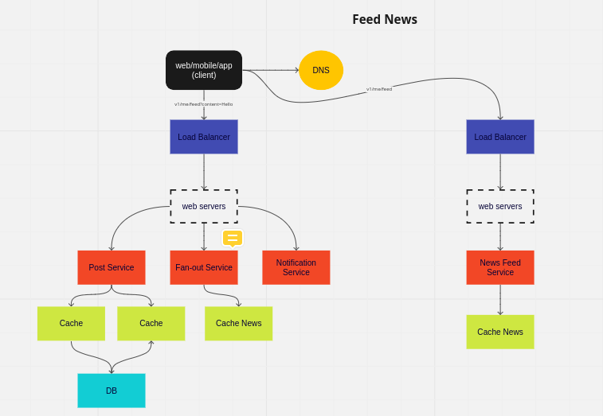

## System Design

- client, server, and model
- networks protocols
- storage
- latency and throughput
- higher availability and consistency
- caching
- proxies
- load balancing
- hashing
- SQL and NoSQL
- replication and sharding
- leader election
- P2P
- polling and streaming
- configuration
- rate limiting
- logging and monitoring
- publish/subscribe
- map reduce
- security and HTTPS
- API design
- elasticity and scalability
  - elasticity: sazionalidade de picos
  - scalability: quantia do DAU

### Perguntas para entender o problema

  Devemos fazer algumas perguntas para entender o problema e definir os requisitos do sistema, como:

  - Qual é o objetivo principal do sistema?
  - Quem serão os usuários do sistema e quais são suas necessidades?
  - Quais são os requisitos funcionais e não funcionais do sistema?
  - Qual é a escala do sistema? Quantos usuários ele precisa suportar?
  - Quais são as limitações ou restrições técnicas que você precisa levar em consideração?
  - Quais são os componentes principais do sistema e como eles interagem entre si?
  - Quais tecnologias, linguagens de programação, frameworks ou plataformas você planeja utilizar?
  - Como você garantirá a segurança do sistema e protegerá os dados dos usuários?
  - Como você planeja lidar com possíveis falhas ou problemas de escalabilidade?
  - Quais são os requisitos de desempenho do sistema? Ele precisa ser altamente disponível ou ter baixa latência?
  - Como você planeja monitorar e realizar manutenção do sistema após o lançamento?
  - Qual é o plano de implantação do sistema? Como você irá configurar, testar e lançar o sistema?
  - Como você irá lidar com a migração de dados, se necessário?
  - Você considerou a modularidade e a extensibilidade do sistema? Ele pode ser facilmente adaptado a mudanças futuras?
  - Como você irá documentar o sistema e compartilhar conhecimento sobre sua arquitetura e funcionamento?

2 - Faz um primeiro high level design (buy in)
  - seria um primeiro rascunho do que seria o sistema, validando com o cliente

### Example: Feed News
[SYSTEM DESIGN: ALÉM DA ENTREVISTA](https://www.youtube.com/watch?v=-8tdjn30SSw)

### Example: Parking Garage
[Amazon System Design Interview: Design Parking Garage
](https://www.youtube.com/watch?v=NtMvNh0WFVM)

- 

### Videos:

  - [20 System Design Concepts Explained in 10 Minutes](https://www.youtube.com/watch?v=i53Gi_K3o7I)
  - [ENTREVISTA SYSTEM DESIGN: O ROADMAP PARA VOCÊ SER CONTRATADO!](https://www.youtube.com/watch?v=-NF06EaAr0I&list=PLs-l5bSgIMhAIi4QIWvzwdyoTFXj9CDFv&index=4)
    - [miro](https://miro.com/app/board/uXjVPfOXbs8=/) 

### References:

- [miro](https://miro.com/app/board/uXjVORFgFfA=/)
- [architectural katas](https://nealford.com/katas/list.html)
- [system design course](https://github.com/karanpratapsingh/system-design)
- [sytem desgin roadmap](https://roadmap.sh/system-design)