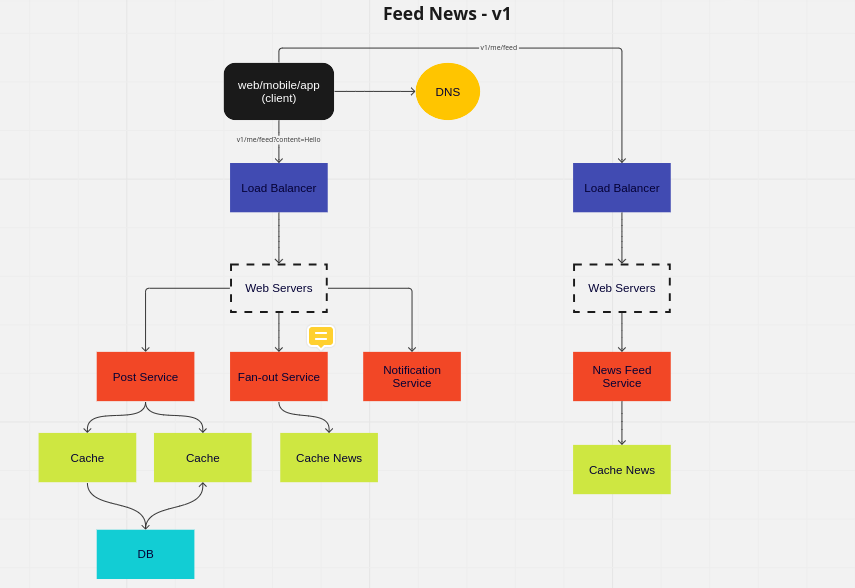
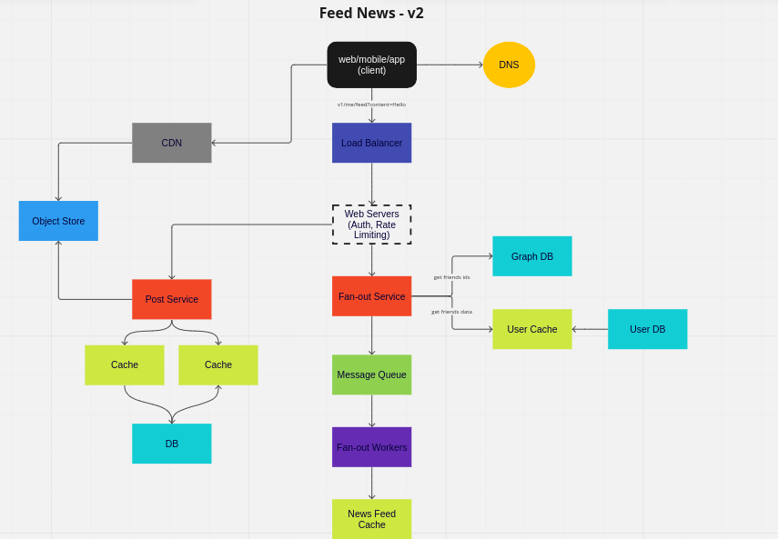

## System Design

- client, server, and model
- networks protocols
- storage
- latency and throughput
- higher availability and consistency
- caching
- proxies
- load balancing
- hashing
- SQL and NoSQL
- replication and sharding
- leader election
- P2P
- polling and streaming
- configuration
- rate limiting
- logging and monitoring
- publish/subscribe
- map reduce
- security and HTTPS
- API design
- elasticity and scalability
  - elasticity: sazionalidade de picos
  - scalability: quantia do DAU

### Análise

1 - Questionar
  - mobile? web? app?
    - tudo
  - quais são as features mais importantes?
    - post / ver notícias dos amigos
  - quantos usuários vão usar a aplicação por dia? volume de tráfego?
    - 10 milhões de DAU (daily active users)
  - pode ter imagem? vídeo? gif?
    - sim

2 - Faz um primeiro high level design (buy in)
  - seria um primeiro rascunho do que seria o sistema, validando com o cliente

### Example: Feed News
[SYSTEM DESIGN: ALÉM DA ENTREVISTA](https://www.youtube.com/watch?v=-8tdjn30SSw)

### Example: Parking Garage
[Amazon System Design Interview: Design Parking Garage
](https://www.youtube.com/watch?v=NtMvNh0WFVM)

### Videos:

  - [20 System Design Concepts Explained in 10 Minutes](https://www.youtube.com/watch?v=i53Gi_K3o7I)
  - [ENTREVISTA SYSTEM DESIGN: O ROADMAP PARA VOCÊ SER CONTRATADO!](https://www.youtube.com/watch?v=-NF06EaAr0I&list=PLs-l5bSgIMhAIi4QIWvzwdyoTFXj9CDFv&index=4)
    - [miro](https://miro.com/app/board/uXjVPfOXbs8=/) 

### References:

- [miro](https://miro.com/app/board/uXjVORFgFfA=/)
- [architectural katas](https://nealford.com/katas/list.html)