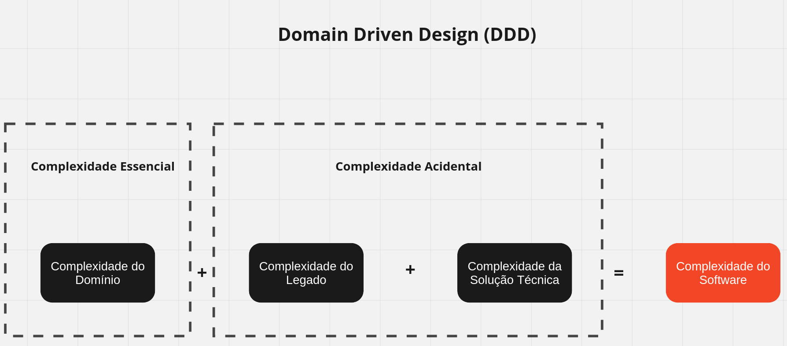
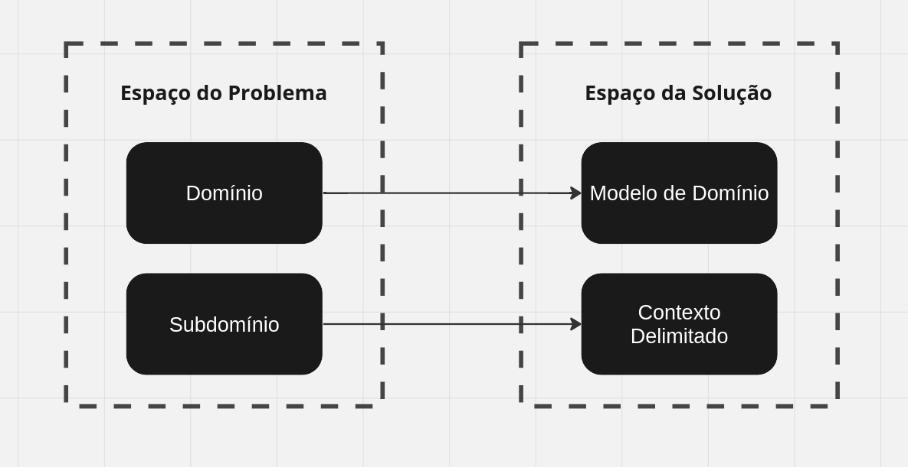
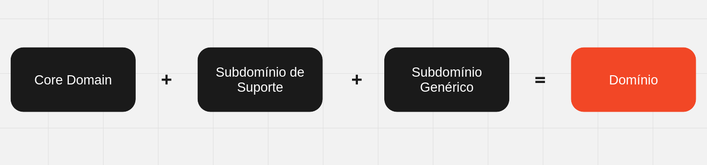
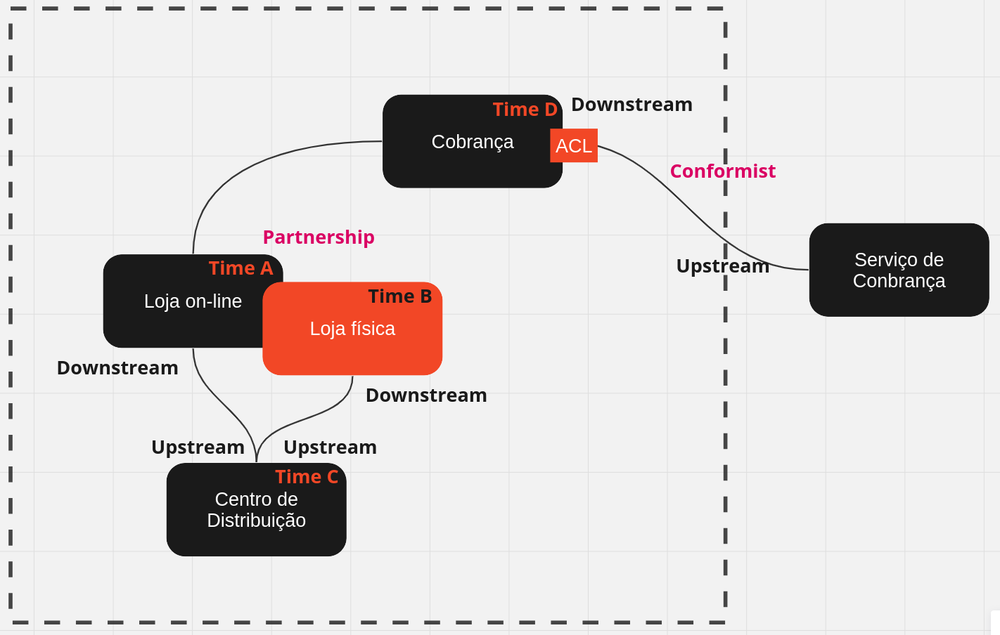
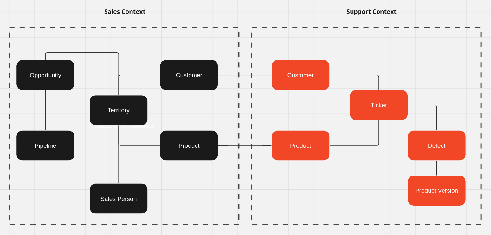

# Domain Driven Design

### Domínio

- É o contexto em que o software está inserido.
- Em vez de começar a escrever o software pensando na sua arquitetura, o correto é pensar nas regras de negócio e no domínio do problema que o software está resolvendo.
  - Exemplo: Uma classe Employee sem contexto é uma classe anêmica, sem sentido. Quando você pensa no domínio, você pensa que um Employee pode ter aumento via promoção, dissídio, acordo coletivo, etc. E aí você começa a pensar em como modelar isso. Sempre pensando nos domínios, nas regras de negócio.
- A ideia é usar a Linguagem de Domínio como uma Linguagem Onipresente, e trazer ela para o código.
- Com essa abordagem mudamos o nosso jeito de pensar em software, não é mais sobre criar um CRUD, mas sim sobre resolver um problema de negócio. Não é mais sobre escrever um monte de código pensando em todos os dados de um novo Employee, mas sim sobre pensar em como um Employee é contratado, como ele é promovido, como ele é demitido, etc.
- Você ao se preocupar com o domínio, você está se preocupando com o negócio, e não com a tecnologia. Você está se preocupando com o problema, e não com a solução. Você não quer apenas preencher o banco de dados, quer dar um sentido a toda informação cadastrada.
- No DDD a primeira coisa que temos que fazer é conversar com o Especialista do Domínio, que é a pessoa que entende do negócio, que sabe como as coisas funcionam. É com ele que vamos aprender sobre o domínio, e é com ele que vamos validar as nossas ideias.
- Um exemplo interessante sobre domínio, no domínio Hospital, para o médico temos um paciente, mas para o financeiro temos um cliente. Nesse caso aonde o paciente está internado é um subdomínio e o financeiro é outro.
- Tendo essa abordagem é mais fácil de criar serviços independentes, pois cada serviço vai ter o seu domínio, e não vai ter que se preocupar com o domínio dos outros serviços.
- As atividades que fazem a empresa ganhar dinheiro são o que chamamos de Core Domain, e as atividades que não fazem a empresa ganhar dinheiro são o que chamamos de Subdomain. Normalmente solução Core deve ser feita internamente, e solução Subdomain pode ser comprada de terceiros. O negócio tem um Core Domain e não a sua aplicação.
- No caso de implementação, por exemplo, você vai aposentar um funcionário, usando SOLID, você não vai modificar uma regra de aposentadoria, que pode mudar a partir do tempo, por causa de alguma lei específica, você vai implementar várias leis diferentes e suas regras, mas não vai mexer no ato de aposentar.
- Você pode ter duas entidades de Médico no sistema, no financeiro é necessário para o pagamento por exemplo, e na enfermagem esse médico pode não ter mais acesso ao sistema, pois ele foi demitido. Nesse caso temos dois subdomínios, o financeiro e o de enfermagem, e cada um tem a sua entidade de Médico. Com esse tipo de abordagem você diminui o custo de manutenção do sistema, pois não precisa ficar fazendo gambiarra para atender a todos os requisitos. Mas aumenta o custo de desenvolvimento, pois você vai ter que implementar a mesma entidade em vários lugares e fazer sync de dados entre os subdomínios, quando necessário.
- O domínio tem relação com você mudar os dados, mas se você precisa consultar os dados, você faz a consulta no banco de dados.

#### Atacando a complexidade do domínio:



A Complexidade do Domínio é a complexidade que faz alguém a querer a comprar um software. É a complexidade que faz o software ser necessário. Complexidade de Domínio é a complexidade do negócio.

#### Linguagem Onipresente

É a linguagem que o especialista do domínio usa para falar sobre o domínio. A ideia é a equipe técnica conversar com o especialista do domínio e aprender a linguagem que ele usa para falar sobre o domínio. E aí usar essa linguagem no código, nos nomes das classes, métodos, variáveis, etc. Não é para o programador tomar nota do problema e sim para ele aprender a linguagem do domínio e usar essa linguagem no código.

O Especialista de Domínio vai acabar te trazendo excelentes cenários para fazer teste. Nenhum Especialista de Domínio conhece tudo sobre o negócio, o ideal é conversar com vários especialistas de domínio, e cada um vai trazer um cenário diferente para testar.


#### Exemplo de Classe Anêmica

É uma classe que não tem sentido, não tem contexto, não tem domínio. É uma classe que não tem nada, só tem os dados. É uma classe que não tem comportamento. É uma classe que não tem regras de negócio.

Muitas vezes começamos a desenvolver pensando no Banco de Dados e não no negócio. Então criamos a classe pensando em como vamos armazenar os dados.

Uma forma de identificar uma classe é anêmica é quando não tem necessidade de testes. Você não estaria testando o código e sim o Ruby, e isso não faz sentido.

```ruby
class Employee
  attr_accessor :name, :age, :salary, :role
end
```

#### Exemplo de Classe Anêmica com Contexto

É uma classe que tem sentido, tem contexto, tem domínio. É uma classe que tem comportamento. É uma classe que tem regras de negócio.

```ruby
class Employee
  attr_accessor :name, :age, :salary, :role

  def promote
    @salary += 1000
  end
end
```

No caso do aumento de salário, existem várias formas de aumentar o salário, e cada uma tem uma regra diferente. Então você pode ter vários métodos de aumentar o salário, e cada um com a sua regra. Por exemplo, um aumento por promoção, um aumento por dissídio, um aumento por acordo coletivo, etc. Mais uma vez, só é possível saber sobre isso se você conversar com o especialista do domínio.

#### Espaço do Problema e Espaço da Solução

O Espaço do Problema é onde você vai conversar com o especialista do domínio, e o Espaço da Solução é onde você vai implementar o código. É importante separar esses dois espaços, pois no Espaço do Problema você não vai pensar em tecnologia, e no Espaço da Solução você não vai pensar em negócio.



#### Subdomínios e Contextos Delimitados (Bounded Context)

Um subdomínio é um contexto delimitado, é um contexto que tem um sentido, que tem um domínio. É um contexto que tem regras de negócio. É um contexto que tem um especialista do domínio.

Por exemplo, em uma Empresa X, ela pode ter subdomínios Vendas, Produção, Marketing, Suporte, Financeiro, etc. Cada um desses subdomínios tem um especialista do domínio, e cada um desses subdomínios tem um domínio diferente.

#### Tipos de Subdomínios

Os tipos de subdomínios são:

- Core Domain: É o domínio principal da empresa, é o domínio que faz a empresa ganhar dinheiro. É o centro do problema, por exemplo, em uma empresa de vendas, o Core Domain é o domínio de vendas.
- Supporting Subdomain: É um domínio que suportam a operação principal da empresa.
- Generic Subdomain: É um domínio que não é diretamente ligado ao funcionamento da empresa, mas é essencial.



#### Context Mapping

É a forma de mapear os contextos delimitados, os subdomínios. É a forma de mapear as relações entre os subdomínios.

  - Shared Kernel: É quando dois subdomínios compartilham o mesmo código, a mesma base de código.
  - Customer/Supplier: É quando um subdomínio é o cliente de outro subdomínio, ou seja, um subdomínio usa o outro subdomínio.
  - Upstream/Downstream: É quando um subdomínio é o upstream de outro subdomínio, ou seja, um subdomínio é o responsável por enviar dados para outro subdomínio.
  - Partnership: É quando dois subdomínios são parceiros, ou seja, eles trabalham juntos.
  - Conformist: É quando um subdomínio é o conformista de outro subdomínio, ou seja, um subdomínio é o responsável por validar os dados de outro subdomínio.
  - Anti-Corruption Layer (ACL): É quando um subdomínio é o responsável por traduzir os dados de outro subdomínio.



#### Entidades e Objetos de Valor

- Entidade: É um objeto que tem identidade, ou seja, que tem um ID. É um objeto que tem um ciclo de vida, que tem um estado. Por exemplo um Funcionário, Cliente, etc.
- Objeto de Valor: Por exemplo um endereço de um Funcionário é um objeto de valor.

As entidades são a cola que une os bounded contexts.



#### References

- [Domain Driven Design do Jeito Certo](https://www.youtube.com/watch?v=cz6EU7Z_BhE)
- [DDD do Jeito Certo](https://ddd-do-jeito-certo.online/)
- [Atacando a complexidade | DDD do jeito certo | Parte 01](https://www.youtube.com/watch?v=2X9Q97u4tUg)
- [Linguagem Onipresente (Ubiquitous Language | DDD do jeito certo | Parte 02)](https://www.youtube.com/watch?v=HnvmpyUAITs)
- [Subdomínios e contextos delimitados | DDD do jeito certo | Parte 03](https://www.youtube.com/watch?v=9hlRHZ4Pfyo)
- [Context Mapping | DDD do jeito certo | Parte 04](https://www.youtube.com/watch?v=yhlaNZ7c494)
- [Entidades e Objetos de Valor | DDD do jeito certo | Parte 05](https://www.youtube.com/watch?v=6Pjod34OCnE)
