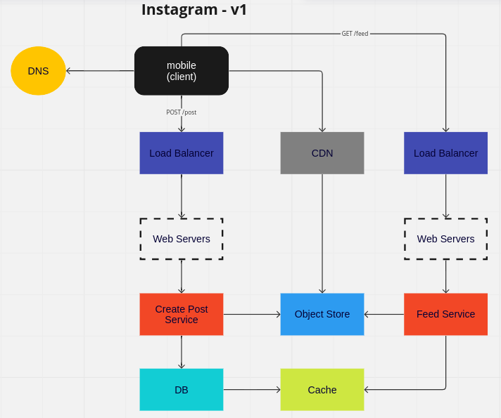

## Example: Instagram

[System Design Mock Interview: Design Instagram](https://www.youtube.com/watch?v=VJpfO6KdyWE)

- Qual é o objetivo principal do sistema?
  - compartilhar fotos, vídeos, fazer comentários, curtir, seguir pessoas e feed.
- Quantos usuários o sistema precisa suportar?
  - 10 milhões de usuários.
- Qual a média de fotos e vídeos que um usuário posta por mês?
  - 10 fotos ou vídeos por mês.
- Qual a média de comentários que um usuário faz por mês?
  - 10 comentários por mês.
- Qual a média de tamanho de fotos?
  - 5 MB.
- Qual a média de tamanho de vídeos?
  - 50 MB.
- Qual a taxa de armazenamento que o sistema precisa suportar?
  - 10 milhões de usuários * 10 fotos por mês * 5 MB = 500 TB.
  - 10 milhões de usuários * 10 vídeos por mês * 50 MB = 50 PB.
  - 10 milhões de usuários * 10 comentários por mês * 1 KB = 100 GB.  
- Quais requisitos funcionais do sistema?
  - adicionar uma foto ou vídeo com uma descrição.
  - deletar uma foto ou vídeo.
  - curtir uma foto ou vídeo.
  - descurtir uma foto ou vídeo.
  - fazer comentário em uma foto ou vídeo.
  - deletar um comentário.
  - seguir uma pessoa.
  - parar de seguir uma pessoa.
- Quais requisitos não funcionais do sistema?
  - consistente.
  - altamente disponível.
  - tolerante a falhas.
  - escalável.
  - seguro.

### Modelagem do banco de dados

- User
  - id
  - name
  - email
  - nickname
  - location
  - password

- Post
  - id
  - user_id
  - description
  - image_path
  - video_path

- Comment
  - id
  - user_id
  - description

- Follow
  - id
  - follower_id (user_id)
  - following_id (user_id)

- Like
  - id
  - user_id
  - post_id
   
### Endpoints

- POST /posts
  - body:
    - description
    - image_path
    - video_path

- GET /feed
  - params:
    - user_id
  - consiferações: 
    - ordenar por data de criação.
    - mostrar apenas os posts dos usuários que o usuário segue.

- GET /posts/:id

- DELETE /posts/:id
  - user_id

- POST /posts/:id/comments
  - body:
    - description
    - user_id

- DELETE /posts/:post_id/comments/:comment_id
  - user_id

- POST /posts/:id/likes
  - user_id

- DELETE /posts/:post_id/likes/:like_id

- POST /follows
  - body:
    - follower_id
    - following_id

- DELETE /follows/:id
  - body:
    - follower_id
    - following_id

- POST /signup
  - body:
    - name
    - email
    - nickname
    - password

- POST /login
  - body:
    - email/nickname
    - password 

### Diagrama

### Informações adicionais

Para um sistema como o Instagram, com um volume muito grande de imagens dinâmicas e um feed com elas, uma estratégia eficiente para armazenamento pode ser a seguinte:

  - Armazenamento de imagens em servidores de arquivos distribuídos: Utilize um sistema de armazenamento distribuído para armazenar as imagens, como o Amazon S3, Google Cloud Storage ou um sistema de arquivos distribuído personalizado. Esses sistemas oferecem escalabilidade, alta disponibilidade e durabilidade para lidar com um grande volume de imagens.

  - Caching de imagens: Implemente um mecanismo de cache no nível do aplicativo e/ou por meio de uma CDN (Content Delivery Network) especializada para armazenar em cache as imagens mais populares ou recentemente acessadas. Isso reduzirá a carga nos servidores de armazenamento e melhorará o desempenho ao entregar as imagens aos usuários.

  - Dimensionamento horizontal dos servidores de armazenamento: Distribua o armazenamento das imagens em vários servidores para permitir um dimensionamento horizontal adequado. Isso significa dividir as imagens em vários servidores para que cada um deles lide com uma parte do volume total de imagens. Isso ajuda a melhorar a escalabilidade, a capacidade de resposta e o desempenho do sistema.

  - Indexação e metadados: Utilize técnicas eficientes de indexação e metadados para organizar e pesquisar as imagens. Isso facilita a recuperação rápida das imagens com base em critérios como usuário, localização, hashtags, etc.

  - Compactação e otimização de imagens: Aplique técnicas de compactação e otimização de imagens para reduzir o tamanho do arquivo e melhorar o tempo de carregamento. Isso pode incluir o uso de formatos de imagem eficientes, como WebP, e a aplicação de técnicas de compressão sem perdas ou com perdas.

  - Uso de serviços de processamento de imagem: Considere o uso de serviços de processamento de imagem, como o Amazon Rekognition ou o Google Cloud Vision, para realizar tarefas como reconhecimento de objetos, detecção de rostos ou análise de conteúdo. Isso pode ajudar a classificar e filtrar as imagens com base em determinados critérios.

Essas estratégias combinadas ajudarão a lidar com o grande volume de imagens dinâmicas e fornecerão um desempenho escalável e responsivo para os usuários. É importante avaliar constantemente o desempenho e a capacidade do sistema, ajustando e otimizando a estratégia de armazenamento à medida que o sistema cresce e evolui.