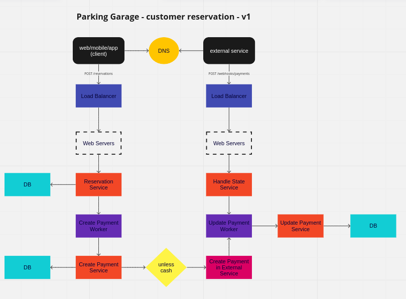
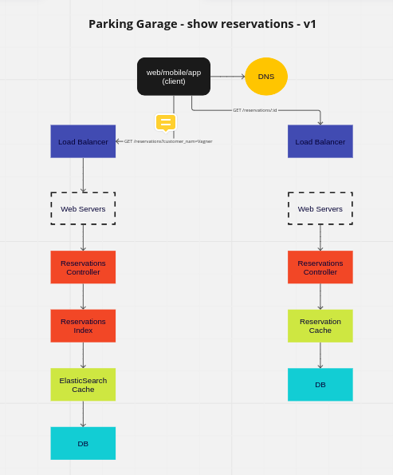

## Example: Parking Garage

[Amazon System Design Interview: Design Parking Garage](https://www.youtube.com/watch?v=NtMvNh0WFVM)

- Qual é o objetivo principal do sistema?
  - reservar uma vaga de estacionamento.
- Quem serão os usuários do sistema e quais são suas necessidades?
  - cliente: alocar uma vaga no estacionamento em uma determinada data para o seu veículo.
  - funcionário: gerenciar as vagas do estacionamento.
- Quais são os requisitos funcionais e não funcionais do sistema?
  - requisitos funcionais:
    - o cliente deve ser capaz de:
      - se cadastrar no sistema.
      - cadastrar um ou vários veículos.
      - reservar uma vaga de estacionamento em uma determinada data.
      - fazer o pagamento da reserva.
      - cancelar uma reserva.
      - visualizar as vagas disponíveis.
      - receber um comprovante de pagamento.
    - o funcionário deve ser capaz de:
      - adicionar uma vaga.
      - cadastrar algum cliente.
      - cadastrar algum veículo.
      - reservar uma vaga para algum cliente.
      - cancelar uma reserva.
      - visualizar as vagas disponíveis.
      - remover uma ou mais vagas.
      - emitir comprovante de pagamento.
      - cadastrar algum funcionário.
  - requisitos não funcionais o sistema deve ser:
    - consistente.
    - altamente disponível.
    - tolerante a falhas.
    - escalável.
    - seguro. 
  - Qual é a escala do sistema? Quantos usuários ele precisa suportar?
    - não foi especificado.
  - Quais as considerações técnicas gerais?
    - será usado um banco de dados relacional para armazenar os dados dos clientes, veículos, vagas e reservas.
    - será usado um meio de pagamento como stripe ou paypal para processar os pagamentos.
    - não será um sistema com alto índice de leitura e escrita.
    - precisa guardar os comprovantes de pagamento.
    - poderá receber em dinheiro, cartão de crédito, débito e pix.
    - é necessário uma aplicação web e mobile.

### Modelagem do banco de dados

- Parking
  - name
  - address
  - zipcode
  - city
  - state
  - complement

- Parking Space
  - name
  - type (bike, car, motorcycle, large car)
  - parking_id
  
- Employee
  - name
  - role
  - parking_id
  - login
  - password

- Customer (oauth gmail, microsoft, facebook)
  - name
  - email
  - phone

- Vehicle
  - type (bike, car, motorcycle, large car)
  - license_plate
  - customer_id

- Reservation
  - customer_id
  - parking_space_id
  - vehicle_id
  - start_date
  - end_date
  - payment_id
  
- Payment
  - type (cash, credit card, debit card, pix)
  - state (paid, pending, canceled)
  - external_id
  - amount

- Price
  - parking_id
  - type (bike, car, motorcycle, large car)
  - amount

### Endpoints

- POST /reservations
  - body:
    - customer_id*
    - vehicle_id*
    - start_date*
    - end_date
  - considerações: o parking_space será definido pelo tamanho do veículo e disponibilidade para o horário. Caso não tenha, será informado pelo sistema. Não é necessário cadastrar uma data final. O sistema irá calcular o valor total da reserva.
  
- POST /webhooks/payments
  - body:
    - external_id*
    - state*
  - considerações: o sistema irá atualizar o estado do pagamento.

- GET /reservations
  - params:
    - customer_name
    - payment_state
    - start_date
    - end_date
  - considerações: o sistema irá retornar as reservas de acordo com os filtros.
  
- GET /reservations/:id
  - considerações: o sistema irá retornar os detalhes da reserva.

- POST /signup?parking_id=ID
  - considerações: o sistema irá cadastrar um novo cliente usando oath.

- POST /login
  - considerações: o sistema irá autenticar o cliente usando oath.

- POST /customer/vehicles
  - body:
    - type*
    - license_plate*
    - customer_id*
  - considerações: o sistema irá cadastrar um novo veículo.

- GET /customer/vehicles/
  - params:
    - type
    - license_plate
  - considerações: o sistema irá retornar os veículos de acordo com os filtros.

- GET /customer/vehicles/:id
  - considerações: o sistema irá retornar os detalhes do veículo.

- GET /vehicles
  - params:
    - type
    - license_plate
  - considerações: o sistema irá retornar os veículos de acordo com os filtros. 

- POST /parkings
  - body:
    - name*
    - address*
    - zipcode*
    - city*
    - state*
    - complement
  - considerações: o sistema irá cadastrar um novo estacionamento.

- POST /parking_spaces
  - body:
    - name*
    - type*
    - parking_id*
  - considerações: o sistema irá cadastrar uma nova vaga.

- POST /parking_spaces/bulk
  - body:
    - name*
    - type*
    - parking_id*
  - considerações: o sistema irá cadastrar várias vagas. Essas vagas serão cadastradas em um arquivo csv.

- GET /parking_spaces
  - params:
    - type
    - name
  - considerações: o sistema irá retornar as vagas de acordo com os filtros.

- GET /parking_spaces/:id
  - considerações: o sistema irá retornar os detalhes da vaga.

- POST /employees
  - body:
    - name*
    - role*
    - parking_id*
    - login*
    - pawssword*
  - considerações: o sistema irá cadastrar um novo funcionário. Pode ser usado uma ferramenta como o Devise. 

- GET /employees
  - params:
    - name
    - role
    - parking_id
  - considerações: o sistema irá retornar os funcionários de acordo com os filtros.

- GET /employees/:id
  - considerações: o sistema irá retornar os detalhes do funcionário.

- POST /prices/bulk
  - body:
    - parking_id*
    - type*
    - amount*
  - considerações: o sistema irá cadastrar os preços das vagas. Esses preços serão cadastrados em um arquivo csv.

- GET /prices
  - considerações: o sistema irá retornar os preços das vagas.

### Diagrama

