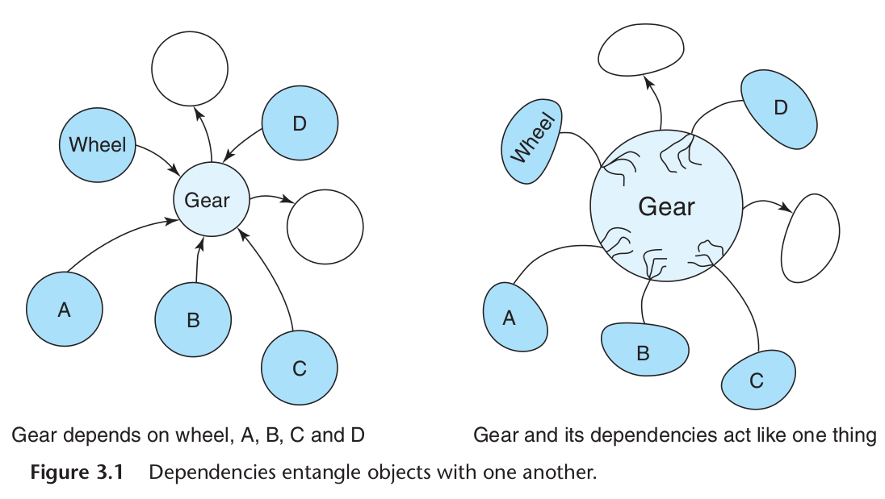

# Practical Object-Oriented Design in Ruby by Sandi Metz

## Chapter 2 - Designing Classes with a Single Responsibility

A fundação da orientação a objeto é a **menssagem**, mas a mais visivel estrutura organizacional é a **classe**. A organização do código serve para que seja possível modificar a classe sem muitos problemas.

O código precisa seguir as seguintes qualidades (TRUE):

  - **Transparent:** As consequências de mudar o código devem ser óbvias e a intenção do código deve ser clara.
  - **Reasonable:** O custo de implementar uma mudança deve ser proporcional ao benefício que ela traz.
  - **Usable:** O código deve ser utilizável em novas situações.
  - **Exemplary:** O código deve encorajar aqueles que o modificam a perpetuar essas qualidades.

Uma classe deve ter uma única responsabilidade, ou seja, ela deve ter apenas um motivo para mudar. Se uma classe tiver mais de uma responsabilidade, ela terá mais de um motivo para mudar. Isso significa que ela terá mais de um motivo para ser alterada.

### Example Application: Bicycles and Gears

```ruby
class Gear
  attr_reader :chainring, :cog

  def initialize(chainring, cog)
      @chainring = chainring
      @cog       = cog
    end

    def ratio
      chainring / cog.to_f
    end
  end
end

puts Gear.new(52, 11).ratio # => 4.7272727272727275
puts Gear.new(30, 27).ratio # => 1.1111111111111112
```

Gear é uma classe que calcula a proporção entre a coroa e o pinhão. Ela tem apenas um motivo para mudar: se a forma de calcular a proporção mudar. Gear é a subclasse de Object, que é a classe base de todas as classes Ruby. Object é uma classe que tem muitas responsabilidades, mas Gear não herda essas responsabilidades.

Caso eu quiser levar em conta o tamanho da roda para o cálculo da proporção, eu posso adicionar um método na classe Gear:

```ruby
class Gear
  attr_reader :chainring, :cog, :rim, :tire

  def initialize(chainring, cog, rim, tire)
    @chainring = chainring
    @cog       = cog
    @rim       = rim
    @tire      = tire
  end

  def ration
    chainring / cog.to_f
  end

  def gear_inches
    # tire goes around rim twice for diameter
    ratio * (rim + (tire * 2))
  end
end

puts Gear.new(52, 11, 26, 1.5).gear_inches # => 137.0909090909091
puts Gear.new(52, 11, 24, 1.25).gear_inches # => 125.27272727272728
puts Gear.new(52, 11).ratio # => ArgumentError: wrong number of arguments (given 2, expected 4)
```
O bug acima acontece porque o método initialize espera 4 argumentos, mas eu só passei 2. Isso acontece porque eu adicionei mais uma responsabilidade para a classe Gear, que é a de calcular o tamanho da roda.

### Why Single Responsibility Matters

A classe Gear tem duas responsabilidades: calcular a proporção e calcular o tamanho da roda. Se eu quiser mudar a forma de calcular a proporção, eu vou ter que mudar a classe Gear. Se eu quiser mudar a forma de calcular o tamanho da roda, eu vou ter que mudar a classe Gear. Isso significa que a classe Gear tem dois motivos para mudar.

Uma classe com mais de uma responsabilidade é difícil de reutilizar. Se as responsabilidades são muito acopladas você não consegue reutilizar uma sem a outra. Com isso você teria que duplicar o código para reutilizar apenas uma das responsabilidades. Duplicar código pode aumentar as chances de gerar bugs.

### Determining if a Class has a Single Responsibility

Como saber se uma classe tem uma única responsabilidade? Para isso você pode fazer as seguintes perguntas:

  - O que a classe faz?
  - O que a classe sabe?
  - Com quem a classe conversa?
  - É possível mudar a classe sem afetar outras partes do sistema?

Para exemplificar, no caso anterior podemos fazer as seguintes perguntas:

  - Por favor Gear, qual é sua proporção?
  - Por favor Gear, quais são as polegadas do seu equipamento?
  - Por favor Gear, qual é o tamanho da roda? - Não faz sentido perguntar isso para Gear, porque Gear ele não deveria saber o tamanho da roda.

Uma classe deve ser fácil de descrever. Se você consegue descrever uma classe em uma sentença, quer dizer que ela tem uma responsabilidade única.

**Nota Pessoal:**
> Uma outra forma de você forçar uma classe a ter uma única responsabilidade é você criar uma classe que tenha apenas um método. No Caso, em vez de eu chamar a classe de Gear, eu poderia chamar de GearInches.

### Determining When to Make Design Decisions

É comum estar em uma situação onde você não sabe o que é certa a fazer com uma classe. Não tem certeza se a classe está com a responsabilidade certa, ou se ela está com várias responsabilidades e o projeto é pequeno, muitas vezes você não sabe do futuro e é difícil tomar uma decisão hoje. Infelizmente em casos que muitas coisas podem acontecer, o melhor é você não perder muito tempo escolhendo, já que você pode tomar uma decisão errada pelas incertezas.

Não se sinta coagido em tomar uma decisão prematura, muitas vezes resistir é o melhor caminho. Mas lembre que decisões tomadas podem ter implecações futuras, já que o código que foi colocado anteriormente pode servir de base para outras decisões. Já que outras pessoas podem não saber que você preferiu não tomar uma abordagem com um designer melhor.

**Nota Pessoal:**
> Uma forma de você minimizar o impacto da sua decisão é deixar de forma explícita o motivo de seguir com aquela abordagem, deixando comentário com data no código. Não vejo como uma prática ruim, comunicação é importante.

### Writing Code That Embraces Change

É possível deixar o código de um jeito que seja fácil mudar **Gear**, mesmo você não sabendo como serão as mudanças futuras.

#### Depend on Behavior, Not Data

Comportamento é capturado nos métodos e invocados pelas mensagens. A frase "Don't Repeat Yourself" (DRY) é baseado nessa ideia. Data pode ser qualquer coisa desde uma simples String até um complexo Hash. Data você pode acessar de duas maneiras, diretamente da variável de instância ou de um método de acesso.

- **Hide instance variables:** Sempre envolva variáveis ​​de instância em métodos de acesso em vez de usar diretamente a variável de instância. Isso permite que você altere a implementação sem alterar a interface pública. Além de você conseguir facilmente identificar quando uma variável está com erro de digitação, já que variáveis de instância sempre vão retornar **nil** caso não existam.

Quando se usa o `attr_reader` está criando um método que encapsula a variável.

```ruby
# default implementation via attr_reader
def cog
  @cog
end
```

This `cog` method é agora o único lugar que entende o que `@cog` significa. Se você quiser mudar a implementação, você pode mudar o método `cog` sem afetar o resto do sistema.

```ruby
# a simple reimplementation of cog
def cog
  @cog * unanticipated_adjustment_factor
end
```

```ruby
# a more complex one
def cog
  @cog * (foo? ? bar_adjustment : baz_adjustment)
end
```

O primeiro exemplo é uma mudança simples, o segundo é uma mudança mais complexa. Mas em ambos os casos, o resto do sistema não precisa saber que a implementação mudou.


#### Hide Data Structures

Se você tem uma coleção de dados, como um Array ou Hash, você pode encapsular a coleção em um objeto. Isso permite que você mude a implementação sem afetar o resto do sistema.

```ruby
class ObscruingReferences
  attr_reader :data

  def initialize(data)
    @data = data
  end

  def diameters
    # 0 is rim, 1 is tire
    data.collect {|cell|
      cell[0] + (cell[1] * 2)}
  end
end
```

```ruby
# rim and tire sizes (now in milimeters!) in a 2d array
@data = [[622, 20], [622, 23], [559, 30], [559, 40]]
```

Caso você mude a estrutura, teria que mudar a implementação do método `diameters`. Mas se você encapsular a coleção em um objeto, você pode mudar a implementação sem afetar o resto do sistema. Este exemplo já é ruim, imagine as consequências se o `data` retornasse um array de hashes que fossem referidos em vários lugares, uma mudança de estrutura poderia cascatiar em vários lugares.

```ruby
class RevealingReferences
  attr_reader :wheels

  def initialize(data)
    @wheels = wheelify(data)
  end

  def diameters
    wheels.collect {|wheel|
      wheel.rim + (wheel.tire * 2)}
  end

  # now everyone can send rim/tire to wheel
  Wheel = Struct.new(:rim, :tire)
  def wheelify(data)
    data.collect { |cell| Wheel.new(cell[0], cell[1]) }
  end
end
```

Essa abordagem é melhor e faz com que `diameters` não se preocupe com a estrutura de `data`, já que esse dado é encapsulado em um objeto. Caso a estrutura mude, você só precisa mudar o método `wheelify`.

**Nota Pessoal:**
> Nesse caso eu passaria o `wheelify` no parâmetro do construtor, para essa classe nem saber o que precisava transformar o dado e botaria um comentário no topo da classe recomendando sempre usar o `wheelify` para transformar o dado.

#### Enforce Single Responsibility Everywhere

Métodos são como classes, eles devem ter uma única responsabilidade. No caso anterior `diameters` faz mais de uma ação, ele percorre o array e calcula o diâmetro. Neste caso você não vai se preocupar com performance, o objetivo é deixar o código mais fácil de mudar.

```ruby
# first - iterate over the array
def diameters
  wheels.collect {|wheel| diameter(wheel)}
end

# second - calculate diameter of ONE wheel
def diameter(wheel)
  wheel.rim + (wheel.tire * 2)
end
```

Neste caso a refatoração não se tornou overdesign, já que o mesmo cálculo já foi usado em outro lugar.

```ruby
def gear_inches
  # tire goes around rim twice for diameter
  ratio * (rim + (tire * 2))
end
```

Claramente o método `gear_inches` está fazendo mais de uma coisa, ele calcula o diâmetro e multiplica pelo `ratio`. Neste caso você pode usar o método `diameter` para deixar o código mais simples.

```ruby
def gear_inches
  ratio * diameter
end

def diameter
  rim + (tire * 2)
end
```

Além de separar as reposabilidades o método ficou mais fácil de ler. Esse problema fez responder que `gear_inches` é uma responsabilidade de `Gear`, mas `diameter` não é. O impacto dessa refatoração é pequeno, mas a acumulação desse efeito no código é gigante. Métodos com responsabilidade única tem os seguintes benefícios:

- **Expose previously hidden qualities:** Refatorar uma classe para ter métodos com responsabilidade única faz com que você entenda melhor a classe e o que ela faz.
- **Avoid the need for comments:** Métodos com responsabilidade única são mais fáceis de ler e entender, não precisando de comentários. Uma documentação bem escrita é melhor que um comentário.
- **Encourage reuse:** Métodos com responsabilidade única são mais fáceis de reutilizar. Dessa forma acaba encorajando a reutilização de código.
- **Are easy to move to another class:** Métodos com responsabilidade única são mais fáceis de mover para outra classe. Dessa forma você pode mover métodos para onde eles pertencem.

**Nota pessoal:**
> Concordo muito com o fato de tentarmos isolar as resposabilidades o máximo possível e tentar deixar o código mais claro, fica muito mais fácil de remover e reutilizar, pra mim por exemplo, toda fórmula deveria ser construída em uma classe de Ruby puro e só ser chamada, se não existe aquele cálculo, vai lá e cria. Uma coisa que não concordo é a interpretação do uso de comentários, em um ambiente real nem todo mundo leu um livro de OOD por exemplo, ou está codando com um prazo apertado, às vezes não tem experiência o suficiente, podem ter diversos motivos para necessitar o uso de comentários, e já vi diversas vezez alguém convencendo todos os outros programadores que é uma prática ruim. Acaba que todos continuam a não fazer documentação, o código permanece ruim e sem a possibilidade de você entender facilmente, comentários são bem vindos sim para sinalizar a intenção por trás daquele código, mas claro, não é pra sair comentando tudo, mas também não é pra sair removendo todos os comentários.

#### Isolate Extra Responsibilities in Classes

Quando você tem um método com mais de uma responsabilidade, você pode isolar as responsabilidades em classes diferentes. Isso é um pouco mais complexo que isolar em métodos, mas o resultado é um código mais fácil de entender e de mudar.

```ruby
class Gear
  attr_reader :chainring, :cog, :wheel

  def initialize(chainring, cog, rim, tire)
    @chainring = chainring
    @cog       = cog
    @wheel     = Wheel.new(rim, tire)
  end

  def ratio
    chainring / cog.to_f
  end

  def gear_inches
    ratio * wheel.diameter
  end

  Wheel = Struct.new(:rim, :tire) do
    def diameter
      rim + (tire * 2)
    end
  end
end
```

O uso de `Wheel` dentro de `Gear` não é muito comum, pode parecer que necessita extrair essa classe, mas como ela só funciona no contexto de `Gear` no momento, não tem por que fazer essa movimentação. Se você tiver muitas responsabilidades em uma classe, separe-as em classes diferentes. Concentre-se nas responsabilidades da classe principal, não deixe que as responsabilidades secundárias atrapalhem, lembre que outra pessoa vai olhar seu código e pode acrescentar algo se você não deixar claro o que está acontecendo.

**Nota pessoal:**
> No mundo real essa técnica é pouca usada e já vi até ser desencorajada, as pessoas sempre vão reclamar, uma coisa que se pode fazer para diminuir o atrito é explicar o fato de ela não necessitar ser extraída no momento, mas seria interessante já criar o teste de forma separada, uma coisa não depende da outra.

> Não tenha medo de postergar uma decisão, mas também não pode ter medo de modificar uma classe, por isso que é importante deixar suas intenções claras em comentários.

#### Finally, the Real Wheel

Agora é necessário aplicar uma nova funcionalidade em `Wheel`, é necessário fazer o cálculo para saber a circunferência. Com isso faz todo o sentido separar `Wheel` de `Gear`.

```ruby
class Gear
  attr_reader :chainring, :cog, :wheel

  def initialize(chainring, cog, wheel=nil)
    @chainring = chainring
    @cog = cog
    @wheel = wheel
  end

  def ratio
    chainring / cog.to_f
  end

  def gear_inches
    ratio * wheel.diameter
  end
end

class Wheel
  attr_reader :rim, :tire

  def initialize(rim, tire)
    @rim = rim
    @tire = tire
  end

  def diameter
    rim + (tire * 2)
  end

  def circumference
    diameter * Math::PI
  end
end

@wheel = Wheel.new(26, 1.5)
puts @wheel.circumference # 91.106186954104

puts Gear.new(52, 11, @wheel).gear_inches # 137.090909090909

puts Gear.new(52, 11).ratio # 4.72727272727273
```

As duas classes tem responsabilidades únicas, o código não é perfeito, mas conseguiu chegar a um nível de muito bom.

## Chapter 3 - Managing Dependencies

### Understanding Dependencies

`Um objeto depende de outro se quando um objeto muda, o outro objeto é forçado a mudar também.`

Se você examinar o código antigo de `Gear` e `Wheel`, você vai perceber o uso de várias dependências que não eram necessárias para `Gear` funcionar. Essas dependências tinham efeitos sobre o estilo do código. Estou falando do código abaixo:

```ruby
class Gear
  attr_reader :chainring, :cog, :rim, :tire

  def initialize(chainring, cog, rim, tire)
    @chainring = chainring
    @cog       = cog
    @rim       = rim
    @tire      = tire
  end

  def ratio
    chainring / cog.to_f
  end

  def gear_inches
    ratio * Wheel.new(rim, tire).diameter
  end
end

class Wheel
  attr_reader :rim, :tire

  def initialize(rim, tire)
    @rim = rim
    @tire = tire
  end

  def diameter
    rim + (tire * 2)
  end
end

Gear.new(52, 11, 26, 1.5).gear_inches # 137.090909090909
```

#### Recognizing Dependencies

Um objeto depende de outro se ele sabe:
- O nome de outra classe. `Gear` espera uma classe com nome de `Wheel` exista.
- O nome da mensagem que ele pretende enviar para alguém que ele conhece. `Gear` sabe que `Wheel` tem um método chamado `diameter`.
- Os argumentos da mensagem são requeridos. `Gear` sabe que `Wheel.new` requer `rim` e `tire`.
- A ordem dos argumentos. `Gear` sabe a ordem dos argumentos de `Wheel.new`.

Cada uma das dependencias criam uma chance de `Gear` mudar. Se `Wheel` mudar o nome do método `diameter` para `wheel_circumference`, `Gear` vai ter que mudar também. Se `Wheel` mudar a ordem dos argumentos, `Gear` vai ter que mudar também.

Essas dependências desnecessárias deixam o código mais difícil de reusar e qualquer pequena mudança gerar uma cascata de modificações em todo o código.

#### Coupling Between Objects (CBO)

`CBO` é uma medida de quanto uma classe conhece sobre outra classe. Quanto mais uma classe conhece sobre outra, mais elas estão acopladas. `Gear` e `Wheel` estão acopladas, pois `Gear` conhece o nome de `Wheel` e o nome do método `diameter`.



A ilustração acima demontra o acoplamento entre as classes. Quando um código é escrito pela primeira vez, tudo fica bem, são as interações constantes sem o devido cuidado que fazem o código ficar ruim. As classes que antes eram independentes, começam a ficar acopladas. E o acoplamento gera dificuldade de reutilizar a classe, então em vez de usar uma classe para resolver o problema, você está tendo que levar junto outras classes que não deveriam ser necessárias.


